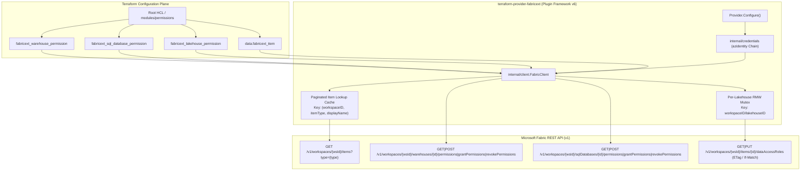
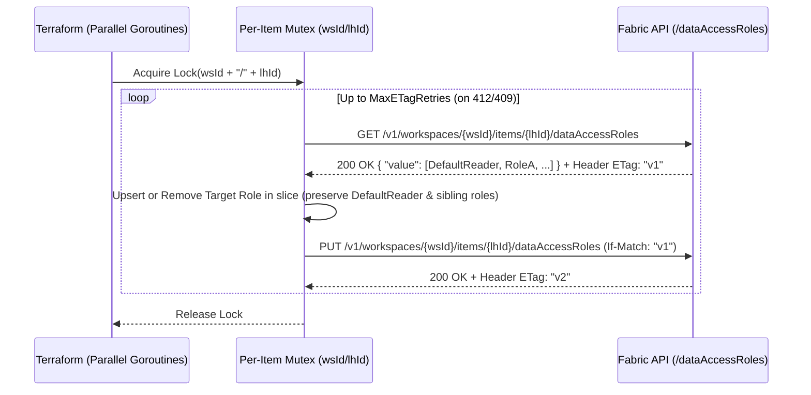
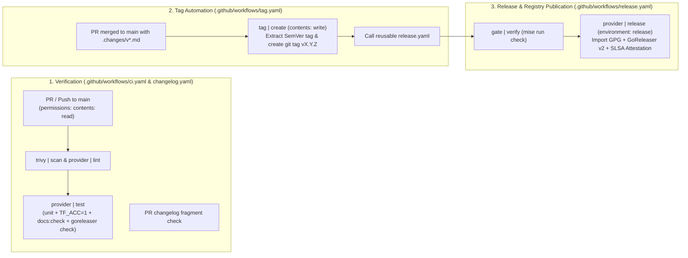

# Design & Architecture Specification: `terraform-provider-fabricext`

> **Stopgap Provider Notice:** `terraform-provider-fabricext` (`registry.terraform.io/jambazid/fabricext`) is an interim, purpose-built **stopgap provider** created exclusively to declaratively manage Microsoft Fabric item-level sharing and permissions (`fabricext_*`) that are not yet available in Microsoft's official [`microsoft/fabric` Terraform provider](https://github.com/microsoft/terraform-provider-fabric). Once equivalent item-level permission and OneLake Data Access Role resources reach general availability in the official `microsoft/fabric` provider, this provider will be deprecated and accompanied by a state-migration guide.
>
> **Pre-Alpha Stability Notice:** This provider is currently in **pre-alpha** (`v0.x`) and is **not stable**. Resource schemas, API contracts, and state representations may change without backwards compatibility prior to `v1.0.0`. Consumers must pin exact provider versions in `required_providers`.

---

## 1. Executive Summary & Problem Statement

### 1.1 Problem Statement

Microsoft's official [`microsoft/fabric` Terraform provider](https://registry.terraform.io/providers/microsoft/fabric/latest) supports provisioning Microsoft Fabric workspaces, capacities, workspace role assignments, and core items (`fabric_warehouse`, `fabric_lakehouse`, `fabric_sql_database`). However, it currently lacks declarative resources for **item-level sharing and granular data-access permissions**:

1. **Fabric Data Warehouses (`Warehouse`)**: Granting and revoking item-level `Read`, `Write`, and `Reshare` permissions to Microsoft Entra ID principals without over-provisioning workspace-wide roles (`Viewer`, `Contributor`, `Member`, `Admin`).
2. **Fabric SQL Databases (`SQLDatabase`)**: Granting and revoking item-level connection (`Read`), T-SQL read-all (`ReadData`), OneLake Spark read-all (`ReadAll` + `SubscribeOneLakeEvents`), `Write`, and `Reshare` permissions.
3. **Fabric Lakehouses (`Lakehouse`)**: Managing OneLake Data Access Roles (`/dataAccessRoles`) that scope folder/table path permissions (`/Tables/...`, `/Files/...`) to specific Microsoft Entra ID security groups, users, or service principals.

Without declarative Terraform resources for these APIs, platform engineering teams are forced to rely on fragile `null_resource` / `local-exec` shell scripts or imperative `azapi_resource_action` workarounds that lack drift detection, state reconciliation, downgrade revocation, and concurrency safety.

### 1.2 Architectural Solution

`terraform-provider-fabricext` bridges this gap with a native Go Terraform Plugin Framework (Protocol v6) provider (`fabricext`) exposing atomic resources under the `fabricext_` prefix:

- **`fabricext_warehouse_permission`**: Declarative lifecycle (`Create`, `Read`, `Update` with downgrade revocation, `Delete`, `ImportState`) for Fabric Warehouse item permissions.
- **`fabricext_sql_database_permission`**: Declarative lifecycle (`Create`, `Read`, `Update` with downgrade revocation, `Delete`, `ImportState`) for Fabric SQL Database item permissions.
- **`fabricext_lakehouse_permission`**: Declarative lifecycle (`Create`, `Read`, `Update`, `Delete`, `ImportState`) for Lakehouse OneLake Data Access Roles using a per-item mutex and optimistic concurrency (`ETag` / `If-Match`) Read-Modify-Write (RMW) loop.
- **`fabricext_item` (Data Source)**: Singular item lookup resolving `(workspace_id, display_name, type)` to its canonical Fabric item `id`.
- **`modules/permissions` (In-Repo HCL Submodule)**: Optional declarative matrix wrapper that flattens a nested workspace configuration (`warehouses`, `lakehouses`, `sql_databases`) into atomic `for_each` resource instances.

---

## 2. Requirements Traceability Matrix

| ID | Requirement Summary | Target Artifacts | Verification Gate |
| :--- | :--- | :--- | :--- |
| **REQ-001** | Refine `.docx` design into an authoritative, zero-gap specification resolving all API, concurrency, auth, and lifecycle defects | [`DESIGN.md`](DESIGN.md), `specs/*.spec.md` | `mise run spec:verify` |
| **REQ-002** | Implement custom Go Terraform provider (`fabricext`) with `fabricext_warehouse_permission`, `fabricext_lakehouse_permission`, `fabricext_sql_database_permission`, and `fabricext_item` | `main.go`, `internal/credentials/`, `internal/client/`, `internal/provider/` | `mise run test:unit`, `mise run test:acc` |
| **REQ-003** | Provide reusable HCL wrapper module (`modules/permissions/`) and zero-module native `for_each` examples | `modules/permissions/*.tf`, `examples/` | `mise run lint`, `mise run scan` |
| **REQ-004** | Consolidate all tooling and tasks into `mise.toml` (`minimum_release_age = "7d"`), retire `Taskfile.yaml`, and enforce `prek` hooks (`commitizen`, `rumdl`, `yamllint`, `zizmor`, `trivy`, `golangci-lint`) | `mise.toml`, `.pre-commit-config.yaml`, `trivy.yaml`, `.golangci.yaml`, `.rumdl.toml`, `.yamllint.yaml` | `mise run check`, `mise exec -- prek run --all-files` |
| **REQ-005** | Generate and validate Registry documentation via `tfplugindocs` with prominent Stopgap and Pre-Alpha banners | `templates/index.md.tmpl`, `docs/`, `README.md` | `mise run docs:check` |
| **REQ-006** | Vendor official `microsoft/fabric-rest-api-specs` OpenAPI definitions and enforce runtime request/response schema validation in mock tests via `kin-openapi` | `specs/openapi/`, `internal/testutil/fabricmock/` | `mise run specs:check`, `mise run test` |
| **REQ-007** | Implement StepSecurity-hardened GitHub Actions CI/CD (`jambazid/gha-actions` style) with automatic Conventional Commits release (`svu` + `goreleaser`) and 7-day Dependabot cooldown | `.github/workflows/ci.yaml`, `.github/dependabot.yaml`, `.goreleaser.yaml`, `terraform-registry-manifest.json` | `mise run scan`, `goreleaser check` |
| **REQ-008** | Document contributor extensibility, roadmap/deprecation policy, and security posture | [`CONTRIBUTING.md`](CONTRIBUTING.md), [`ROADMAP.md`](ROADMAP.md), [`SECURITY.md`](SECURITY.md) | `mise run lint` |

---

## 3. System Architecture & Data Flow



---

## 4. Native Authentication & Credential Provider Chain (`internal/credentials`)

Rather than shelling out to external CLIs on every request, `internal/credentials` implements the exact credential resolution architecture of Microsoft's official Fabric provider using Microsoft's official Go Identity SDK: **`github.com/Azure/azure-sdk-for-go/sdk/azidentity`**, **`github.com/Azure/azure-sdk-for-go/sdk/azcore/policy`**, and **`software.sslmate.com/src/go-pkcs12`**.

### 4.1 Token Scopes & Sovereign Cloud Environments

Microsoft Entra ID token audience scopes are dynamically resolved based on the configured `environment` (`"public"`, `"usgovernment"`, `"china"`):

| Cloud Environment | Azure SDK Cloud (`cloud.Configuration`) | Microsoft Fabric Token Scope |
| :--- | :--- | :--- |
| `public` (Default) | `cloud.AzurePublic` | `https://api.fabric.microsoft.com/.default` |
| `usgovernment` | `cloud.AzureGovernment` | `https://api.fabric.microsoft.us/.default` |
| `china` | `cloud.AzureChina` | `https://api.fabric.microsoft.cn/.default` |

### 4.2 Ordered Credential Evaluation Chain (100% Parity with Official Provider)

`credentials.NewChain(cfg)` replaces all pre-existing authentication wiring with a unified, ordered evaluation chain matching `microsoft/terraform-provider-fabric`:

1. **`StaticTokenProvider` (`Source: "static_access_token"`)**:
   - Uses explicit `access_token` from provider configuration or `FABRIC_ACCESS_TOKEN`.
   - Primary mechanism for hermetic unit/acceptance testing (`TF_ACC=1` against `fabricmock`) and pre-minted CI tokens.
2. **`ClientCertificateProvider` (`Source: "service_principal_client_certificate"`)**:
   - Uses `software.sslmate.com/src/go-pkcs12` to parse base64-encoded PKCS#12 certificate bundles (`client_certificate`) or files (`client_certificate_file_path`) with optional password (`client_certificate_password`).
   - Instantiates `azidentity.NewClientCertificateCredential(tenantID, clientID, certs, key, &options)`.
3. **`ClientSecretProvider` (`Source: "service_principal_client_secret"`)**:
   - Uses `azidentity.NewClientSecretCredential(tenantID, clientID, clientSecret, &options)`.
   - Supports direct strings or file paths (`tenant_id_file_path`, `client_id_file_path`, `client_secret_file_path`).
   - **OIDC 3-Tuple Fallthrough Law**: In GitHub Actions OIDC (`azure/login`), `AZURE_TENANT_ID` and `AZURE_CLIENT_ID` are exported *without* `AZURE_CLIENT_SECRET`. If only 1 or 2 of the 3 values are set via environment variables, `ClientSecretProvider` records a skipped diagnostic and cleanly falls through to OIDC and CLI providers.
4. **`AzureDevOpsOIDCProvider` (`Source: "azure_devops_workload_identity_federation"`)**:
   - Uses `azidentity.NewAzurePipelinesCredential` when `azure_devops_service_connection_id` (or `FABRIC_AZURE_DEVOPS_SERVICE_CONNECTION_ID`) and OIDC request tokens (`SYSTEM_ACCESSTOKEN` / `oidc_request_token`) are supplied.
5. **`WorkloadIdentityProvider` (`Source: "workload_identity_oidc"`)**:
   - Supports direct `oidc_token`, `oidc_token_file_path`, or assertion callback via `azidentity.NewClientAssertionCredential`, and automatic Kubernetes/Actions federation via `azidentity.NewWorkloadIdentityCredential` when `AZURE_FEDERATED_TOKEN_FILE` is present.
6. **`ManagedIdentityProvider` (`Source: "managed_identity"`)**:
   - Uses `azidentity.NewManagedIdentityCredential` when `use_msi = true` or `FABRIC_USE_MSI` / `ARM_USE_MSI` is present.
   - Distinguishes **System-Assigned** (`clientID == ""`) from **User-Assigned** (`&azidentity.ManagedIdentityCredentialOptions{ID: azidentity.ClientID(clientID)}`).
7. **`AzureDeveloperCLIProvider` (`Source: "azure_developer_cli"`)**:
   - Uses `azidentity.NewAzureDeveloperCLICredential` when `use_dev_cli = true` or `FABRIC_USE_DEV_CLI=true`.
8. **`AzureCLIProvider` (`Source: "azure_cli"`)**:
   - Uses `azidentity.NewAzureCLICredential` (enabled by default via `use_cli = true` or `FABRIC_USE_CLI`).
   - **Zero Subprocess / Shell Execution**: Operates exclusively via the official Microsoft Azure SDK for Go (`github.com/Azure/azure-sdk-for-go/sdk/azidentity`). No raw `os/exec` subprocesses, shell invocations, or temporary token files are spawned anywhere in the codebase.

### 4.3 Multi-Tenant Acquisition (`auxiliary_tenant_ids`)

When `auxiliary_tenant_ids` (or `FABRIC_AUXILIARY_TENANT_IDS`) is specified, the chain propagates the slice to `AdditionallyAllowedTenants` across all underlying `azidentity` credential options, supporting multi-tenant Microsoft Fabric architectures.

### 4.4 Token Caching, Refresh & Secret Redaction Invariants

- **Thread-Safe Caching & Proactive Refresh**: `Chain` caches the resolved `azcore.AccessToken` in memory (`sync.RWMutex`) and refreshes it automatically when `time.Until(token.ExpiresOn) < 2*time.Minute`.
- **Secret Redaction**: `Credentials` and `Config` implement `fmt.Stringer` and `fmt.GoStringer` masking raw bearer tokens, client secrets, certificate bytes, and passwords as `"[REDACTED]"`.
- **Exhausted Chain Diagnostics**: When all sources fail, `Chain.GetToken(ctx)` returns a `*ChainError` wrapping `ErrNoCredentials` listing every attempted source and its diagnostic failure reason.

---

## 5. Fabric API Client, OpenAPI Contract Validation & Concurrency Architecture

### 5.1 Paginated Item Lookup & Type-Isolated Cache

In Microsoft Fabric, creating a `Lakehouse` or `SQLDatabase` named `analytics_gold` automatically provisions a companion `SQLEndpoint` item also named `analytics_gold` in the same workspace.

- **Endpoint**: `GET /v1/workspaces/{workspaceId}/items?type={itemType}` (following `continuationToken` query parameters until `continuationToken` is empty).
- **Cache Key**: Strictly `(workspaceID, itemType, displayName)` where `itemType` is one of `"Warehouse"`, `"Lakehouse"`, or `"SQLDatabase"`.
- **Cache-Miss Refresh**: If an item is not found in a previously cached workspace page list, the cache entry for `(workspaceID, itemType)` is invalidated once and re-fetched from the API to handle items created during the same Terraform run.
- **Reverse Lookup on Import (`GetItemByID`)**: When a resource is imported via `terraform import` using its UUID composite ID, `Read` calls `GetItemByID(ctx, workspaceID, itemID, itemType)` to populate the required `warehouse_name`, `sql_database_name`, or `lakehouse_name` state attribute.

### 5.2 HTTP Resilience (`Retry-After` & Transient 5xx Backoff)

- **Rate Limiting (`429 Too Many Requests`)**: Parses the `Retry-After` response header (seconds) and waits for the specified duration (or exponential backoff with jitter starting at `BaseBackoff` (`100ms` default) if `Retry-After` is absent), respecting `ctx.Done()`.
- **Transient Server Errors (`502`, `503`, `504`)**: Retries up to `MaxRetries` (default `5`) with exponential backoff (`BaseBackoff * 2^attempt`) plus bounded jitter, respecting `ctx.Done()`.

### 5.3 Item Permissions Lifecycle (Warehouse & SQL Database)

Both `Warehouse` (`/v1/workspaces/{workspaceId}/warehouses/{warehouseId}/...`) and `SQLDatabase` (`/v1/workspaces/{workspaceId}/sqlDatabases/{sqlDatabaseId}/...`) use the item permissions RPC surface:

| Resource | `role_type` Value | Expanded Fabric API `permissions` Array |
| :--- | :--- | :--- |
| `fabricext_warehouse_permission` | `"read"` | `["Read"]` |
| `fabricext_warehouse_permission` | `"write"` | `["Read", "Write"]` |
| `fabricext_warehouse_permission` | `"reshare"` | `["Read", "Reshare"]` |
| `fabricext_sql_database_permission` | `"read"` | `["Read"]` (Connect-only; granular access managed via T-SQL) |
| `fabricext_sql_database_permission` | `"read_data"` | `["Read", "ReadData"]` (Read all data via T-SQL) |
| `fabricext_sql_database_permission` | `"read_spark"` | `["Read", "ReadAll", "SubscribeOneLakeEvents"]` (OneLake Spark access) |
| `fabricext_sql_database_permission` | `"write"` | `["Read", "Write"]` |
| `fabricext_sql_database_permission` | `"reshare"` | `["Read", "Reshare"]` |

- **`Create`**: Resolves item `displayName` $\rightarrow$ `itemID`, then `POST .../grantPermissions` with `{"principal": {"id": principalID, "type": principalType}, "permissions": [...]}`.
- **`Read`**: `GET .../permissions`, locates the matching `(principal.id, principal.type)` entry (case-insensitive), and maps its canonical `permissions` array back to `role_type`. Also refreshes the item's `displayName` via `GetItemByID`. If the item returns `404 Not Found` or the principal is no longer present in the permissions list, calls `resp.State.RemoveResource(ctx)`.
- **`Update` (Downgrade Revocation Law)**: Because `/grantPermissions` is additive, changing `role_type` from `"write"` (`["Read", "Write"]`) to `"read"` (`["Read"]`) cannot simply call `/grantPermissions`. `UpdateItemPermissions` computes the set difference `toRevoke = oldPerms \ newPerms` and `toGrant = newPerms \ oldPerms`:
  1. If `len(toRevoke) > 0`, calls `POST .../revokePermissions` with `permissions: toRevoke`.
  2. If `len(toGrant) > 0` (or to ensure target state), calls `POST .../grantPermissions` with `permissions: newPerms`.
- **`Delete`**: Calls `POST .../revokePermissions` with the full set of granted permissions for the principal. Treats `404 Not Found` as idempotent success.

### 5.4 Lakehouse OneLake Data Access Roles Concurrency & ETag RMW Loop

Microsoft Fabric's OneLake Data Access Security endpoint (`GET` & `PUT /v1/workspaces/{workspaceId}/items/{itemId}/dataAccessRoles`) operates on the **entire array of roles** for a Lakehouse as a single document guarded by HTTP `ETag` / `If-Match`.



- **In-Process Mutex**: `FabricClient` maintains a `sync.Map` of per-Lakehouse mutexes keyed by `workspaceID + "/" + lakehouseID` so parallel Terraform resource workers (`-parallelism=10`) operating on the same Lakehouse serialize their Read-Modify-Write cycles deterministically within the process.
- **Cross-Process & Distributed Concurrency Across Independent Stacks/Pipelines**:
  - Microsoft Fabric provides **no distributed locking API** (no lease or advisory lock endpoints on workspaces or Lakehouses).
  - Cross-process and cross-pipeline synchronization relies strictly on HTTP `ETag` + `If-Match` optimistic concurrency.
  - Every `GET /dataAccessRoles` captures the response `ETag` header. The mutating request submits `PUT /dataAccessRoles` with `If-Match: <ETag>`.
  - If an independent Terraform stack or external process commits a modification between the `GET` and `PUT`, Fabric rejects the second mutation with HTTP `412 Precondition Failed` (or `409 Conflict`).
  - `FabricClient` automatically intercepts `412`/`409`, refetches the latest remote role array and updated `ETag`, reapplies the target role mutation in-memory, and retries with linear backoff plus jitter (up to 10 attempts / $\sim 5.5\text{s}$).
  - For cross-stack isolation where multiple stacks declare permissions on the same workspace, Terraform remote backend state locking (e.g. Terraform Cloud, Azure Blob Storage lease, or S3 DynamoDB lock) remains the standard IaC control preventing concurrent runs on shared stacks.
- **Preservation of Built-in & Sibling Roles**: `UpsertDataAccessRole` replaces only the role matching `role_name` (case-insensitive match, preserving canonical name) or appends it if new, leaving `DefaultReader` and all other roles untouched. `DeleteDataAccessRole` filters out only `role_name` (case-insensitive match).
- **Official Payload Structure** (verified against `microsoft/fabric-rest-api-specs/platform/definitions/platform.json` and `microsoft/fabric-sdk-go/fabric/core`):

  ```json
  {
    "value": [
      {
        "name": "GoldLayerReaders",
        "decisionRules": [
          {
            "effect": "Permit",
            "permission": [
              {
                "attributeName": "Path",
                "attributeValueIncludedIn": ["/Tables/gold_sales", "/Files/raw"]
              },
              {
                "attributeName": "Action",
                "attributeValueIncludedIn": ["Read"]
              }
            ]
          }
        ],
        "members": {
          "microsoftEntraMembers": [
            {
              "tenantId": "<workspace-or-configured-tenant-id>",
              "objectId": "11111111-1111-1111-1111-111111111111",
              "objectType": "Group"
            }
          ]
        }
      }
    ]
  }
  ```

### 5.5 Runtime OpenAPI Contract Validation (`internal/testutil/fabricmock`)

- All vendored Swagger 2.0 specs under `specs/openapi/` (`platform/`, `warehouse/`, `lakehouse/`, `sqlDatabase/`, `common/`, and `overlays/item-permissions.json`) are verified by SHA-256 digest in `specs/openapi/lock.json` and loaded at test initialization by `github.com/getkin/kin-openapi` (`openapi2` $\rightarrow$ `openapi2conv.ToV3`).
- `fabricmock.Server` wraps its stateful HTTP router in an `openapi3filter` validation middleware that validates **every incoming HTTP request** (`openapi3filter.ValidateRequest`) and **every outgoing HTTP response** (`openapi3filter.ValidateResponse`) against the converted OpenAPI v3 schemas.

---

## 6. Provider, Resource & Data Source Schemas

### 6.1 Provider Schema (`provider "fabricext"`)

| Attribute | Type | Required | Environment Variable Fallback | Description |
| :--- | :--- | :--- | :--- | :--- |
| `endpoint` | `String` | Optional | `FABRIC_ENDPOINT` | Base URL for the Microsoft Fabric REST API. Defaults to `"https://api.fabric.microsoft.com"`. |
| `access_token` | `String` (`Sensitive`) | Optional | `FABRIC_ACCESS_TOKEN` | Static Microsoft Entra ID bearer token for the Fabric API. |
| `tenant_id` | `String` | Optional | `AZURE_TENANT_ID`, `ARM_TENANT_ID`, `FABRIC_TENANT_ID` | Microsoft Entra ID tenant UUID. |
| `client_id` | `String` | Optional | `AZURE_CLIENT_ID`, `ARM_CLIENT_ID`, `FABRIC_CLIENT_ID` | Service Principal or Managed Identity client UUID. |
| `client_secret` | `String` (`Sensitive`) | Optional | `AZURE_CLIENT_SECRET`, `ARM_CLIENT_SECRET`, `FABRIC_CLIENT_SECRET` | Service Principal client secret. |
| `use_oidc` | `Bool` | Optional | `AZURE_USE_OIDC`, `ARM_USE_OIDC`, `FABRIC_USE_OIDC` | Enable Workload Identity (OIDC) federated token authentication. |
| `use_msi` | `Bool` | Optional | `AZURE_USE_MSI`, `ARM_USE_MSI`, `FABRIC_USE_MSI` | Enable Azure Managed Identity authentication. |
| `use_cli` | `Bool` | Optional | `AZURE_USE_CLI`, `ARM_USE_CLI`, `FABRIC_USE_CLI` | Enable Azure CLI credential fallback. |
| `request_timeout` | `String` | Optional | `FABRIC_REQUEST_TIMEOUT` | Per-request HTTP timeout (Go duration string, e.g. `"60s"`). Defaults to `"60s"`. |
| `skip_credentials_validation` | `Bool` | Optional | `FABRIC_SKIP_CREDENTIALS_VALIDATION` | Skip eager token acquisition during `Configure()`. Defaults to `false`. |

See the embedded Terraform Registry guide [`docs/guides/official_provider_comparison.md`](docs/guides/official_provider_comparison.md) (generated from [`templates/guides/official_provider_comparison.md.tmpl`](templates/guides/official_provider_comparison.md.tmpl) via `mise run docs`) for the full comparative analysis with Microsoft's official [`microsoft/terraform-provider-fabric`](https://github.com/microsoft/terraform-provider-fabric) and the Terraform 1.7+ state migration playbooks for Lakehouses, Warehouses, and SQL Databases.

### 6.2 `fabricext_warehouse_permission` Resource

- **Composite ID & Import Format**: `{workspace_id}/{warehouse_id}/{principal_type}/{principal_id}`
- **Attributes**:
  - `id` (`String`, `Computed`, `UseStateForUnknown`)
  - `workspace_id` (`String`, `Required`, `RequiresReplace`, UUID validator)
  - `warehouse_name` (`String`, `Optional` + `Computed`, `RequiresReplace`, non-empty validator)
  - `warehouse_id` (`String`, `Optional` + `Computed`, `RequiresReplace`, UUID validator; at least one of `warehouse_name` or `warehouse_id` must be provided)
  - `principal_id` (`String`, `Required`, `RequiresReplace`, UUID validator)
  - `principal_type` (`String`, `Optional` + `Computed`, default `"Group"`, `RequiresReplace`, `OneOf("User", "Group", "ServicePrincipal", "ServicePrincipalProfile")`)
  - `role_type` (`String`, `Required`, `OneOf("read", "write", "reshare")`)

### 6.3 `fabricext_sql_database_permission` Resource

- **Composite ID & Import Format**: `{workspace_id}/{sql_database_id}/{principal_type}/{principal_id}`
- **Attributes**:
  - `id` (`String`, `Computed`, `UseStateForUnknown`)
  - `workspace_id` (`String`, `Required`, `RequiresReplace`, UUID validator)
  - `sql_database_name` (`String`, `Optional` + `Computed`, `RequiresReplace`, non-empty validator)
  - `sql_database_id` (`String`, `Optional` + `Computed`, `RequiresReplace`, UUID validator; at least one of `sql_database_name` or `sql_database_id` must be provided)
  - `principal_id` (`String`, `Required`, `RequiresReplace`, UUID validator)
  - `principal_type` (`String`, `Optional` + `Computed`, default `"Group"`, `RequiresReplace`, `OneOf("User", "Group", "ServicePrincipal", "ServicePrincipalProfile")`)
  - `role_type` (`String`, `Required`, `OneOf("read", "read_data", "read_spark", "write", "reshare")`)

### 6.4 `fabricext_lakehouse_permission` Resource

- **Composite ID & Import Format**: `{workspace_id}/{lakehouse_id}/{role_name}`
- **Dual-Mode Ergonomic Architecture**:
  - **Core Identifiers**:
    - `id` (`String`, `Computed`, `UseStateForUnknown`)
    - `workspace_id` (`String`, `Required`, `RequiresReplace`, UUID validator)
    - `lakehouse_name` (`String`, `Optional` + `Computed`, `RequiresReplace`, non-empty validator)
    - `lakehouse_id` (`String`, `Optional` + `Computed`, `RequiresReplace`, UUID validator; at least one of `lakehouse_name` or `lakehouse_id` must be provided)
    - `role_name` (`String`, `Required`, `RequiresReplace`, `^[a-zA-Z][a-zA-Z0-9_]*$` validator)
    - `kind` (`String`, `Optional` + `Computed`, default `"Policy"`, `OneOf("Policy")`)
  - **Simple Flat Mode (100% Backward Compatible)**:
    - `paths` (`Set[String]`, `Optional` + `Computed`, `SizeAtLeast(1)`)
    - `actions` (`Set[String]`, `Optional` + `Computed`, default `["Read"]`, `OneOf("Read", "Write", "ReadWrite")`)
    - `principal_ids` (`Set[String]`, `Optional` + `Computed`, `SizeAtLeast(1)`, UUID element validator)
    - `principal_type` (`String`, `Optional` + `Computed`, default `"Group"`, `OneOf("User", "Group", "ServicePrincipal", "ManagedIdentity")`)
  - **Advanced Structured Mode (Feature Parity with Upstream OneLake Data Access Security)**:
    - `decision_rule` (`List[Block]`, `Optional`): Repeatable decision rules containing:
      - `paths` (`Set[String]`, `Required`)
      - `actions` (`Set[String]`, `Optional` + `Computed`, default `["Read"]`, `OneOf("Read", "Write", "ReadWrite")`)
      - `effect` (`String`, `Optional` + `Computed`, default `"Permit"`, `OneOf("Permit")`)
      - `row_constraint` (`List[Block]`, `Optional`): Row-Level Security (RLS) predicates with `table_path` (`String`, `Required`) and `predicate` (`String`, `Required`, T-SQL expression).
      - `column_constraint` (`List[Block]`, `Optional`): Column-Level Security (CLS) masks with `table_path` (`String`, `Required`), `columns` (`Set[String]`, `Required`), `action` (`String`, `Optional`, default `"Read"`), and `effect` (`String`, `Optional`, default `"Permit"`).
    - `entra_member` (`Set[Block]`, `Optional`): Heterogeneous Entra ID members with `object_id` (`String`, `Required`), `object_type` (`String`, `Required`, `OneOf("User", "Group", "ServicePrincipal", "ManagedIdentity")`), and `tenant_id` (`String`, `Optional`). State refresh correlates existing state by `object_id`/`tenant_id` to preserve configured `object_type` when Fabric API omits `objectType` on GET.
    - `fabric_item_member` (`Set[Block]`, `Optional`): Cross-item shortcut members with `source_path` (`String`, `Required`, `{workspace_id}/{item_id}` UUID pair format) and `item_access` (`Set[String]`, `Optional`, default `["ReadAll"]`).
  - **Identifier Consistency & Replacement Law**: In `Create` across `warehouse`, `sql_database`, and `lakehouse`, the provider determines configured identifiers directly from resource configuration (`req.Config`). If both the item name and item ID are explicitly configured, the provider validates that the fetched display name matches the configured name, returning a diagnostic error on conflict before setting state. On resource replacement where an item identifier changes, `ModifyPlan` resets the unconfigured counterpart identifier in the plan to unknown (`(known after apply)`), preventing stale computed identifiers copied by `UseStateForUnknown` from causing false replacement conflicts or inconsistent plan/apply results.

### 6.5 `fabricext_item` Data Source

- **Attributes**:
  - `workspace_id` (`String`, `Required`, UUID validator)
  - `display_name` (`String`, `Required`, non-empty validator)
  - `type` (`String`, `Required`, `OneOf("Warehouse", "Lakehouse", "SQLDatabase", "SQLEndpoint", "SemanticModel")`)
  - `id` (`String`, `Computed`): Resolved Fabric item UUID.

### 6.6 Architectural Decision Record (ADR): Atomic Resources vs. Monolithic `fabricext_workspace_permissions_model`

- **Context**: A single workspace-wide resource (`fabricext_workspace_permissions_model`) accepting a nested map of all item permissions across a workspace was evaluated as an alternative to atomic per-item resources (`fabricext_*_permission`) + HCL composition.
- **Decision**: Reject the workspace-wide monolithic resource in favor of atomic resources (`fabricext_warehouse_permission`, `fabricext_sql_database_permission`, `fabricext_lakehouse_permission`) paired with both a Zero-Module Native HCL `for_each` pattern and the in-repo `modules/permissions/` submodule.
- **Rationale (HashiCorp Provider Design Principles)**:
  1. **One Resource, One API**: A workspace-wide resource conflates 4 distinct APIs (`Items_List`, Warehouse `/permissions`, SQLDatabase `/permissions`, and Lakehouse `/dataAccessRoles`).
  2. **Failure Isolation**: In a monolithic resource, an HTTP `429`/`400` failure on the 9th of 12 items leaves the single Terraform resource in a partially-applied state; with atomic resources, each binding is tracked independently in `terraform.tfstate`.
  3. **Drift & Import**: `resp.State.RemoveResource(ctx)` and `terraform import` operate on individual resource instances; a workspace-wide resource cannot cleanly remove or import a single item without affecting the entire workspace.

---

## 7. Declarative Composition: Zero-Module HCL & In-Repo Wrapper Submodule

### 7.1 Option A: Zero-Module Native HCL Matrix Pattern

Practitioners can map a declarative matrix of permissions directly onto the atomic resources without consuming any external module:

```hcl
locals {
  workspace_id = "00000000-0000-0000-0000-000000000001"
  warehouse_grants = {
    "sales_wh:analysts" = { warehouse = "sales_wh", principal_id = "11111111-1111-1111-1111-111111111111", role = "read" }
    "sales_wh:etl_spn"  = { warehouse = "sales_wh", principal_id = "22222222-2222-2222-2222-222222222222", role = "write" }
  }
}

resource "fabricext_warehouse_permission" "this" {
  for_each       = local.warehouse_grants
  workspace_id   = local.workspace_id
  warehouse_name = each.value.warehouse
  principal_id   = each.value.principal_id
  role_type      = each.value.role
}
```

### 7.2 Option B: Bundled In-Repo Submodule (`modules/permissions/`)

`modules/permissions/` accepts a unified `fabric_permissions_matrix` variable (`workspace_id`, `warehouses`, `sql_databases`, `lakehouses`), flattens the nested structures via `flatten([...])` keyed by `"${item_name}/${principal_type}/${principal_id}"` (so role upgrades/downgrades execute in place without recreate races), and provisions `fabricext_warehouse_permission`, `fabricext_sql_database_permission`, and `fabricext_lakehouse_permission` resources deterministically even when optional item maps are omitted.

In the v0.2.0 uplift, `modules/permissions/` expands to:

1. Support direct item UUIDs as map keys (in addition to item display names) across `warehouses`, `sql_databases`, and `lakehouses`.
2. Support advanced Lakehouse OneLake Data Access Roles: repeatable `decision_rules` with Row-Level Security (`row_constraints`), Column-Level Security (`column_constraints`), heterogeneous `entra_members`, and `fabric_item_members` alongside the standard simple flat role configuration.

---

## 8. Distribution, Local Mirror & CI/CD Release Architecture

Following [`hashicorp/terraform-provider-scaffolding-framework`](https://github.com/hashicorp/terraform-provider-scaffolding-framework), Changie release management, and StepSecurity privilege-isolation standards, continuous verification, tagging, and release publication are separated into dedicated workflows:



1. **Separated Verification vs. Release Workflows (`ci.yaml`, `tag.yaml`, & `release.yaml`)**:
   - **`ci.yaml`**: Runs on `pull_request` and `push` to `main` with read-only `contents: read` permissions and zero access to `GPG_PRIVATE_KEY` or the `release` GitHub Environment. Excludes non-code docs while guaranteeing test runs on `specs/**` and `DESIGN.md`. Renders statement coverage breakdowns to `$GITHUB_STEP_SUMMARY`, uploads coverage artifacts, updates PR sticky comments across both passing and failing runs, and validates the 90.0% coverage threshold via a dedicated verification step to ensure consistent error communication between step summaries and PR discussions.
   - **`changelog.yaml`**: Verifies that pull requests include required Changie fragments (`.changes/unreleased/*.yaml`) before merging.
   - **`tag.yaml`**: Triggered on `push` to `main` when `.changes/v*.md` files are added or modified. Extracts the version, validates strict SemVer format (`^v[0-9]+\.[0-9]+\.[0-9]+(-[0-9A-Za-z.-]+)?(\+[0-9A-Za-z.-]+)?$`), creates the git tag `vX.Y.Z` using `GITHUB_TOKEN`, and invokes `release.yaml` at the running commit via `uses: ./.github/workflows/release.yaml`.
   - **`release.yaml`**: Reusable workflow (`workflow_call` or manual `workflow_dispatch`):
     - **Stage 1 (`gate | verify`)**: Executes full verification gate (`mise run check`) before touching release secrets.
     - **Stage 2 (`provider | release`)**: Runs inside the protected `release` GitHub Environment (`contents: write`, `id-token: write`, `attestations: write`). Imports the GPG signing key via `step-security/ghaction-import-gpg`, runs `goreleaser release --clean` (pinned to match `mise.lock`), and emits SLSA Build Level 2 provenance attestations via `actions/attest-build-provenance`.
2. **Public & Private Registry Packaging (`.goreleaser.yaml` & `terraform-registry-manifest.json`)**:
   - Builds static (`CGO_ENABLED=0`) reproducible binaries (`mod_timestamp: '{{ .CommitTimestamp }}'`, `-trimpath`, `-ldflags='-s -w -X main.version={{.Version}} -X main.commit={{.Commit}}'`) named `terraform-provider-fabricext_v{{ .Version }}` across `linux`/`darwin`/`windows`/`freebsd` and `amd64`/`arm64`/`386`/`arm`.
   - Generates `${ProjectName}_${Version}_SHA256SUMS`, signs it with GPG (`--batch --local-user {{ .Env.GPG_FINGERPRINT }} --detach-sign`), and attaches `terraform-registry-manifest.json` (`protocol_versions: ["6.0"]`).
3. **Air-Gapped / Local Filesystem Mirror (`mise run install-local`)**:
   - Installs the compiled binary into `~/.terraform.d/plugins/registry.terraform.io/jambazid/fabricext/<version>/${GOOS}_${GOARCH}/terraform-provider-fabricext_v<version>` for offline runners or local testing.

---

## 9. Security & Supply-Chain Hardening Controls

1. **StepSecurity Harden-Runner & Pinned Actions**:
   - Every job in `.github/workflows/ci.yaml` and `.github/workflows/release.yaml` begins with `step-security/harden-runner` (`egress-policy: audit`).
   - All actions (`actions/checkout`, `actions/attest-build-provenance`, `step-security/harden-runner`, `step-security/mise-action`, `step-security/ghaction-import-gpg`) are pinned to full 40-character commit SHAs with `# vX.Y.Z` comments.
2. **7-Day Supply-Chain Cooldown & Grouped Dependabot Updates (`TeamPCP` Mitigation)**:
   - `mise.toml` enforces `lockfile = true` and `minimum_release_age = "7d"`.
   - `.github/dependabot.yaml` enforces `cooldown: { default-days: 7 }` on `github-actions` and `gomod`, with grouped updates for `github.com/hashicorp/terraform-plugin-*` and GitHub Actions (following `hashicorp/terraform-provider-scaffolding-framework`).
   - `mise run bump` executes `actions-up --min-age 7`.
3. **Zero `pull_request_target`, Zero Script Injection & `depguard` SDK Enforcement**:
   - Workflows trigger only on safe `pull_request`, `push`, and `workflow_dispatch` events with `permissions: {}` at top level and `persist-credentials: false` on every `actions/checkout`.
   - Dynamic expressions are never interpolated directly in `run:` scripts; all values pass through `env:`.
   - `.golangci.yaml` enforces `depguard` rules banning `github.com/hashicorp/terraform-plugin-sdk/v2` imports alongside `usetesting`, `govet`, `staticcheck`, `errcheck`, `gosec`, and `revive`.
4. **Continuous Vulnerability, Secret & Misconfiguration Scanning**:
   - `trivy fs` (vulnerabilities, secrets, misconfigurations) and `trivy config` (Terraform HCL scanning) + `zizmor` (GitHub Actions static analysis) run with identical configurations both locally in `prek` hooks and in CI (`trivy | scan` and `provider | lint`).
