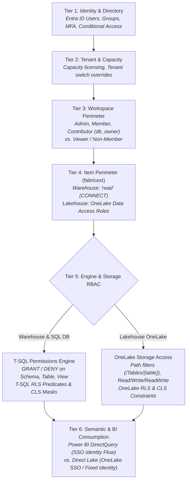
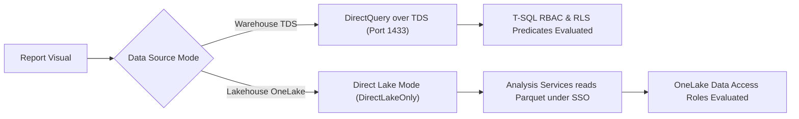

# Granular Access Control Patterns

This architectural guide explains the multi-layered security architecture of Microsoft Fabric across Microsoft Entra ID, workspace boundaries, item-level sharing, SQL engine permissions (T-SQL), OneLake Data Access Roles, and Power BI semantic models.

It addresses how granular permissions propagate across data engines, how to manage Entra ID Object IDs vs. display names in SQL, how to isolate access to specific schemas within a Fabric Warehouse, how declarative schema migration tools like **Atlas** conceptually fit into database-level Role-Based Access Control (RBAC), and how [`terraform-provider-fabricext`](https://registry.terraform.io/providers/jambazid/fabricext/latest) enables an automated enterprise access model.

---

## Access Goals & Solutions

The following matrix maps enterprise access control requirements to their Microsoft Fabric architectural solutions, highlighting where `terraform-provider-fabricext` enables declarative Infrastructure as Code (IaC):

| Access Goal / Scenario | Recommended Solution | Mechanism & Boundary | `fabricext` Provider Role |
| :--- | :--- | :--- | :--- |
| **Broad Workspace Access**<br/>User needs to read or collaborate on all items across a workspace. | Assign **Viewer** (read-only) or **Contributor** (read/write) workspace role. | **Tier 3 (Workspace)**<br/>Workspace role assignment via Fabric Portal or `microsoft/fabric`. | **Out of Scope**<br/>Handled by official `fabric_workspace_role_assignment`. |
| **Warehouse Schema Isolation**<br/>User needs access to schema `finance` only; all other schemas (`hr`, `sales`) must be denied. | Grant item **`read`** (connectivity only) + create Entra DB user + grant T-SQL schema permissions. | **Tier 4 (Item Share) + Tier 5 (SQL Engine)**<br/>Item share grants Tabular Data Stream (TDS, port 1433) `CONNECT`; default-deny SQL engine restricts data access. | **Item Connectivity Gate**<br/>`fabricext_warehouse_permission` (`role_type = "read"`) grants TDS connection without granting `db_owner` rights. *(Note: Warehouses support `ReadData` platform-wide; `fabricext` restricts to `read` to enforce schema isolation).* |
| **SQL Database Broad Access**<br/>User needs read access across all tables in a Fabric SQL Database. | Grant item-level **`read_data`** share on the SQL database item. | **Tier 4 (Item Share)**<br/>Item permission grants connectivity and broad data access across all tables in the operational OLTP database. | **Direct**<br/>`fabricext_sql_database_permission` (`role_type = "read_data"`). |
| **SQL Database Spark Analytics**<br/>Spark notebooks require read access to OneLake mirrored database data. | Grant item-level **`read_spark`** share on the SQL database item. | **Tier 4 (Item Share) + Tier 5 (Storage)**<br/>Grants Spark access to near-real-time mirrored Parquet data and event subscriptions. | **Direct**<br/>`fabricext_sql_database_permission` (`role_type = "read_spark"`). |
| **Object-Level Security (OLS)**<br/>User can access specific tables or views within a schema, but sensitive tables are hidden. | Item **`read`** + T-SQL `GRANT SELECT ON table/view`. | **Tier 5 (SQL Engine)**<br/>SQL metadata hiding ensures unpermitted tables are invisible in `sys.tables`. | **Item Connectivity Gate**<br/>`fabricext_warehouse_permission` (`role_type = "read"`). |
| **SQL Row/Column Security (RLS/CLS)**<br/>Warehouse user should only see regional rows or cannot see credit card columns. | Item **`read`** + T-SQL Security Policies (predicate function) & `DENY SELECT ON table(col)`. | **Tier 5 (SQL Engine)**<br/>T-SQL execution engine filters rows/columns at query runtime. | **Item Connectivity Gate**<br/>`fabricext_warehouse_permission` (`role_type = "read"`). |
| **Lakehouse Path & Folder Access**<br/>Lakehouse user needs access to specific Delta tables without SQL engine. | Configure OneLake Data Access Role with path attribute scopes (`paths = ["/Tables/sales"]`). | **Tier 4 & 5 (OneLake Storage)**<br/>OneLake security evaluates path filters against storage operations (`actions = ["Read"]`). | **Direct**<br/>`fabricext_lakehouse_permission` (simple mode with `paths` and `actions = ["Read"]`). |
| **Lakehouse Storage RLS & CLS**<br/>Lakehouse user needs row-filtering or column-masking on Delta tables. | Configure OneLake Data Access Role with `row_constraint` and `column_constraint`. | **Tier 5 (OneLake Engine)**<br/>Centralized policy enforced at query time by authorized engines (Spark, Analysis Services). | **Direct**<br/>`fabricext_lakehouse_permission` (advanced mode with `decision_rule`). |
| **Cross-Workspace Data Sharing**<br/>Derive OneLake role membership from users who have item permissions on another Fabric item. | Configure Lakehouse role containing `fabric_item_member` referencing the source workspace and item path. | **Tier 4 & 5 (OneLake Security)**<br/>OneLake dynamically inherits role membership from the source item permissions. | **Direct**<br/>`fabricext_lakehouse_permission` (`fabric_item_member` blocks). |
| **Power BI Semantic Model Consumption**<br/>Power BI report users must only see data permitted by their Entra identity. | Use **Direct Lake with Single Sign-On (SSO)** or DirectQuery over TDS. | **Tier 6 (Consumption)**<br/>Power BI Analysis Services delegates user's active Entra token to data engine. | **Underlying Engine Gate**<br/>`fabricext_*` manages item connectivity and OneLake Data Access Roles. |
| **Enterprise RBAC & Schema Automation**<br/>Automate both item-level gates and internal database RBAC across environments. | Combine Terraform with declarative database schema-as-code operators (e.g. Atlas, Flyway, or Liquibase). | **Tiers 1–5 Integrated**<br/>Terraform provisions Entra & Fabric gates; schema operator configures T-SQL objects via Entra token. | **Prerequisite Gateway**<br/>Provides prerequisite connectivity gate (`CONNECT`) enabling database-level operators. |

---

## Controls Inventory & Interactions

Microsoft Fabric evaluates access across six distinct security tiers. Understanding which tier takes precedence and how controls interact is essential for robust least-privilege design.

### 1. The Controls Inventory

| Tier | Control Type | Primary Governance Plane | Description |
| :--- | :--- | :--- | :--- |
| **Tier 1: Identity** | Entra ID Groups & Principals | Azure Entra ID / Graph | Authenticates users (User Principal Name / UPN), security groups (display name), and service principals; establishes group memberships. |
| **Tier 2: Tenant & Capacity** | Tenant Switch Overrides & Domains | Fabric Admin Portal | Controls external sharing toggles, OneLake access API switches, and capacity assignment boundaries. |
| **Tier 3: Workspace Boundary** | Workspace Roles | Fabric Workspace API / `microsoft/fabric` | Roles: `Admin`, `Member`, `Contributor`, `Viewer`. Determines administrative and collaboration scope. |
| **Tier 4: Item Perimeter** | Item Shares & Permissions | Fabric Item Permission API / `fabricext` | Roles: `read` (CONNECT to Tabular Data Stream / TDS endpoint), `read_data` (SQL DB broad read), `read_spark` (SQL DB Spark analytics), `write`, `reshare`, OneLake Data Access Roles. Controls item discovery and gateway access. |
| **Tier 5: Data Engine RBAC** | T-SQL RBAC & OneLake Storage Roles | SQL TDS Engine / OneLake Storage Engine | T-SQL `GRANT`/`DENY` on Schemas/Tables/Views, SQL Row-Level Security (RLS), Column-Level Security (CLS), OneLake path filters, and row/column constraints over Tabular Data Stream (TDS, port 1433). |
| **Tier 6: Consumption & BI** | Semantic Models & Power BI Apps | Power BI Analysis Services | Direct Lake mode, DirectQuery fallback over TDS, Entra Single Sign-On (SSO) token delegation, and dataset-level RLS/Object-Level Security (OLS). |

### Control Precedence Matrix

When multiple controls apply to a principal simultaneously, Fabric evaluates access according to strict precedence rules:

| Condition / Conflict | Evaluation Precedence | Net Effective Access | Architecture Rule |
| :--- | :--- | :--- | :--- |
| **Workspace `Member` vs. T-SQL `DENY`** | Workspace Role **overrides** T-SQL RBAC. | **Full Access** (`db_owner`) | Workspace `Admin`, `Member`, and `Contributor` bypass all SQL-level restrictions. |
| **Workspace `Viewer` vs. T-SQL `GRANT`** | T-SQL RBAC **governs** data query. | **Granular Access** | `Viewer` grants item visibility; SQL engine filters data according to T-SQL grants. |
| **Item `read_data` vs. T-SQL `DENY`** | Item `read_data` **bypasses** SQL schema isolation. | **Broad Data Access** | Fabric grants a synthetic read token across all tables when `read_data` is present. |
| **Item `read` vs. T-SQL Default-Deny** | T-SQL engine **governs** object access. | **Strict Schema Isolation** | `read` provides TDS `CONNECT` only; ungranted schemas remain completely hidden and inaccessible. |
| **Lakehouse OneLake Role vs. Direct Lake** | OneLake Security **filters** storage reads. | **Filtered Parquet Access** | Analysis Services respects OneLake path filters and RLS/CLS when SSO is active. |
| **Warehouse T-SQL RLS vs. Direct Lake** | T-SQL Security **triggers fallback**. | **DirectQuery over TDS** | Direct Lake on SQL endpoints falls back to DirectQuery over TDS to enforce SQL security. |
| **Dataset RLS vs. Underlying SQL RLS** | **Both** evaluated in series (Intersection). | **Most Restrictive Subset** | Power BI filters data in the semantic model; SQL engine filters data at query time via SSO. |

---

## Security Perimeter Stack

Security in Microsoft Fabric is governed by six decoupled, cascading evaluation perimeters. A principal must clear each tier sequentially to access an underlying data element:



### Workspace Role Inheritance

> [!CAUTION]
> **Workspace Roles Bypass SQL Engine RBAC**:
> Users assigned **Admin**, **Member**, or **Contributor** roles on a Fabric workspace are automatically granted `db_owner` / full administrative privileges on all Warehouses and Lakehouses in that workspace.
> 
> T-SQL `DENY` statements, SQL Row-Level Security, and OneLake Data Access Roles **have no effect** on Admins, Members, or Contributors.
> 
> While the **Viewer** workspace role respects T-SQL permissions, it grants read access across *all* items in the workspace (including inspecting notebooks, pipelines, and unconfigured Lakehouses). To enforce strict least privilege and cross-item isolation, principals should have **no workspace role** (pure item share via `fabricext`).

---

## Warehouse Schema Isolation

When you grant permissions using `fabricext_warehouse_permission`:

| Permission Token | API Action | SQL Engine Effect | Schema Visibility |
| :--- | :--- | :--- | :--- |
| **`read`** *(Recommended)* | `Read` | Grants database connectivity (`CONNECT`) over Tabular Data Stream (TDS, port 1433). | **Strictly Restricted**: User sees only schemas and objects explicitly granted in T-SQL. |
| **`write`** | `Write` | Grants permission to modify item metadata and write tables. | Full read/write access. |
| **`reshare`** | `Reshare` | Grants permission to share the warehouse with other principals. | Shareable access. |

```text
Analyst (Entra Group)       Fabric Portal / Hub         Fabric Item Security       Warehouse SQL Engine (TDS)
         │                           │                            │                            │
         │─── 1. Access Data Hub ───►│                            │                            │
         │                           │─── 2. Query Shared Items ─►│                            │
         │                           │◄── 3. Item List (Read) ────│                            │
         │◄── 4. "Shared with me" ───│                            │                            │
         │                                                        │                            │
         │─── 5. Connect via TDS Endpoint (Port 1433) ────────────────────────────────────────►│
         │                                                        │                            │
         │                                                        │◄── 6. Validate Token ──────│
         │                                                        │─── 7. "Read" (CONNECT OK) ─►
         │                                                        │                            │
         │─── 8. SELECT * FROM hr.salaries; ──────────────────────────────────────────────────►│
         │◄── 9. Error 229: SELECT permission denied on object 'salaries', schema 'hr' ────────┤
         │                                                                                     │
         │─── 10. SELECT * FROM finance.revenue; ─────────────────────────────────────────────►│
         │◄── 11. 200 OK (Data returned via T-SQL GRANT) ──────────────────────────────────────┤
```

### Non-Member Console Experience

When an Entra security group receives `read` via `fabricext_warehouse_permission` without workspace membership:

1. **OneLake Data Hub**: The Warehouse appears under the **"Shared with me"** tab and in the OneLake Data Hub catalog.
2. **Workspace Navigation**: The user **cannot** see the parent workspace in the workspace flyout menu.
3. **Web Query Editor**: Clicking the Warehouse opens the Web Query Editor. The object explorer renders only the schemas and tables that the user's Entra credentials have SQL permissions to view (metadata hiding). Schemas without `GRANT` permissions do not appear in the tree.
4. **Connection Endpoints**: The user can copy the TDS connection string (`*.datawarehouse.fabric.microsoft.com`) and connect via SQL Server Management Studio (SSMS), Azure Data Studio, VS Code, Python, or DBeaver.

---

## Entra ID Identity Binding

A frequent practitioner question is how Microsoft Entra ID identities map between Terraform configurations and T-SQL database statements:

1. **In Terraform (`fabricext`)**: `principal_id` strictly requires the **36-character Microsoft Entra Object ID (UUID)**:

   ```hcl
   resource "fabricext_warehouse_permission" "finance_access" {
     workspace_id   = "00000000-0000-0000-0000-000000000001"
     warehouse_id   = "00000000-0000-0000-0000-000000000002"
     principal_id   = azuread_group.finance_analysts.object_id # Immutable UUID
     principal_type = "Group"
     role_type      = "read" # Connectivity only
   }
   ```

2. **In T-SQL Engine**:

   - For **Security Groups**: Use the exact Display Name:

     ```sql
     CREATE USER [SEC-Fabric-Finance-Analysts] FROM EXTERNAL PROVIDER;
     ```

   - For **Individual Users**: Strictly require the UserPrincipalName (UPN):

     ```sql
     CREATE USER [bob@contoso.com] FROM EXTERNAL PROVIDER;
     ```

   - For **B2B Guest Users**: Use the external transformed UPN:

     ```sql
     CREATE USER [external_user#EXT#@tenant.onmicrosoft.com] FROM EXTERNAL PROVIDER;
     ```

   - **Why Bracketed UUIDs Fail**: T-SQL queries Microsoft Graph filtering strictly on `displayName eq '<name>'` or `userPrincipalName eq '<name>'`. It does not filter on `id eq '<guid>'`. Passing a raw UUID fails unless the object's display name literally matches that UUID string.
   - **Duplicate Display Names**: If duplicate display names exist in a tenant (triggering `Msg 33131: Principal '...' has a duplicate display name`), use the official syntax:

     ```sql
     CREATE USER [Finance-Analysts-Alias] FROM EXTERNAL PROVIDER WITH OBJECT_ID = '11111111-1111-1111-1111-111111111111';
     ```

   - **Identifier Escaping**: Group display names containing closing brackets (e.g. `SG-Data[Finance]-US`) must escape the bracket as `]]` in T-SQL (`CREATE USER [SG-Data[Finance]]-US] FROM EXTERNAL PROVIDER;`).

| Plane | Tool | Identity Identifier | Rationale |
| :--- | :--- | :--- | :--- |
| **Item Gate** | Terraform (`fabricext`) | Microsoft Entra **Object ID (UUID)** | Immutable; impervious to Entra group renames in Azure Portal. |
| **SQL Engine** | T-SQL / Schema Operator | Microsoft Entra **Display Name / UPN** | Human-readable in DBA query plans, SSMS Object Explorer, and audit logs. |

---

## Lakehouse OneLake Security

Microsoft Fabric Lakehouses store data in OneLake in open Delta Parquet format. Security is enforced directly through **OneLake Data Access Roles** operating on a centralized policy, distributed enforcement model:

```hcl
resource "fabricext_lakehouse_permission" "sales_analysts_advanced" {
  workspace_id = "00000000-0000-0000-0000-000000000001"
  lakehouse_id = "00000000-0000-0000-0000-000000000002"
  role_name    = "SalesRegionalAuditors"

  entra_member {
    object_id   = "11111111-1111-1111-1111-111111111111"
    object_type = "Group"
  }

  decision_rule {
    effect  = "Permit"
    paths   = ["/Tables/sales"]
    actions = ["Read"]

    row_constraint {
      table_path = "/Tables/sales"
      predicate  = "Region = 'EMEA'"
    }

    column_constraint {
      table_path = "/Tables/sales"
      columns    = ["CustomerKey", "SalesAmount", "Region"]
      action     = "Read"
      effect     = "Permit"
    }
  }
}
```

---

## Power BI Query Modes

A critical architectural distinction governs reporting in Microsoft Fabric:



### Direct Lake Credential Delegation

> [!WARNING]
> **Direct Lake Identity Delegation & Fixed-Identity Risks**:
> In Microsoft Fabric, Direct Lake semantic models operate under Single Sign-On (SSO) by default, passing the active viewer's Microsoft Entra ID token to evaluate OneLake Data Access Roles. However, if the semantic model connection is modified to use a **Fixed Identity** (such as a shared connection or model owner credentials in **Semantic Model Settings > Gateway and Cloud Connections**), Analysis Services queries OneLake as that fixed identity (often an administrative account), **bypassing all OneLake Data Access Roles** configured via `fabricext_lakehouse_permission` for report viewers. Maintain Single Sign-On on the Direct Lake connection whenever granular OneLake roles must govern end-user data visibility.

Key query execution rules:

- **Direct Lake on OneLake**: Operates exclusively in `DirectLakeOnly` mode and does **not** fall back to DirectQuery. Unsupported DAX functions or security rules return a query error.
- **DirectQuery Fallback on Warehouses**: When a semantic model queries a Warehouse with SQL RLS/CLS, Power BI automatically falls back from Direct Lake to DirectQuery over TDS (port 1433).
  - *Without SSO*: Queries run as the model owner (`db_owner`), causing unintended query execution under elevated dataset-owner privileges.
  - *With SSO*: All report viewers must hold an item-level `read` permission (`fabricext_warehouse_permission`) AND database-level T-SQL grants. Configure SSO in **Workspace > Semantic Model > Settings > Gateway and cloud connections > Data source credentials > Edit credentials > Advanced > check "Report viewers can only access this data source with their own Power BI identities using Direct Query"**.

---

## Declarative RBAC Automation

While `fabricext` manages the Fabric item boundary (`CONNECT`), managing internal database schemas, tables, roles, and `GRANT SELECT` statements across dozens of Warehouses is typically automated using a declarative database schema management tool or migration framework (such as [Atlas](https://atlasgo.io/), Flyway, Liquibase, or the Terraform `mssql` provider).

### Architecture Blueprint

> [!IMPORTANT]
> **TDS Authentication & Privileges**: Fabric Warehouse TDS endpoints (port 1433) **only support Microsoft Entra ID authentication**; standard SQL username/password logins are unsupported. The CI/CD identity running the schema operator must authenticate via Entra ID (CLI session, service principal, or workload identity) and hold administrative privileges (`db_owner` / workspace Contributor or Admin) to create users, schemas, and grant permissions.

```hcl
# --- 1. Identity & Workspace Provisioning ---
resource "azuread_group" "finance_analysts" {
  display_name     = "SEC-Fabric-Finance-Analysts"
  security_enabled = true
}

resource "fabric_workspace" "analytics" {
  display_name = "Enterprise Analytics"
}

resource "fabric_warehouse" "corporate_dw" {
  workspace_id = fabric_workspace.analytics.id
  display_name = "corporate_dw"
}

# --- 2. Item-Level Gate via fabricext ---
# Grants TDS connectivity (CONNECT) without administrative workspace rights
resource "fabricext_warehouse_permission" "finance_access" {
  workspace_id   = fabric_workspace.analytics.id
  warehouse_id   = fabric_warehouse.corporate_dw.id
  principal_id   = azuread_group.finance_analysts.object_id
  principal_type = "Group"
  role_type      = "read"
}

# --- 3. Declarative SQL RBAC via Schema Operator (Conceptual Example) ---
# Note: Generic conceptual pseudocode representing a database
# schema-as-code operator (e.g. Atlas, Flyway) managing SQL objects over TDS.
# The schema operator authenticates via Microsoft Entra token.
resource "atlas_schema" "warehouse_rbac" {
  url = "sqlserver://${fabric_warehouse.corporate_dw.properties.connection_info.endpoint_fqdn}:1433?database=${fabric_warehouse.corporate_dw.display_name}&fedauth=ActiveDirectoryDefault"
  src = file("${path.module}/schemas/warehouse_security.hcl")

  depends_on = [
    fabric_warehouse.corporate_dw
  ]
}
```

---

## Dedicated Deep-Dive Guides

For in-depth architectural analysis, sequence diagrams, and runnable Terraform configurations, explore the dedicated guides:

| Guide | Core Focus |
| :--- | :--- |
| **[Security Controls & Interactions](../docs/guides/use_case_controls_and_interactions.md)** | Tier inventory, precedence rules, and workspace role bypass rules. |
| **[Warehouse Schema Isolation](../docs/guides/use_case_warehouse_schema_isolation.md)** | Least-privilege `read` connectivity, Entra ID naming, and SQL RBAC. |
| **[Lakehouse OneLake Security](../docs/guides/use_case_lakehouse_onelake_security.md)** | Data Access Roles, path filters, storage RLS/CLS, and shortcuts. |
| **[Power BI Identity Flow](../docs/guides/use_case_powerbi_identity_propagation.md)** | DirectQuery vs. Direct Lake SSO token propagation and fallback. |
