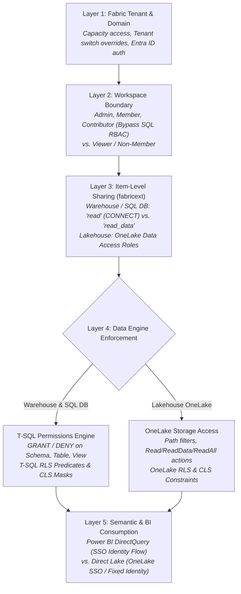
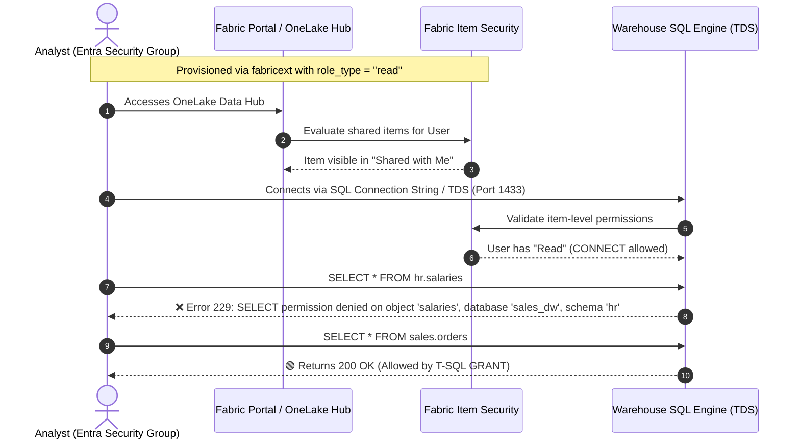
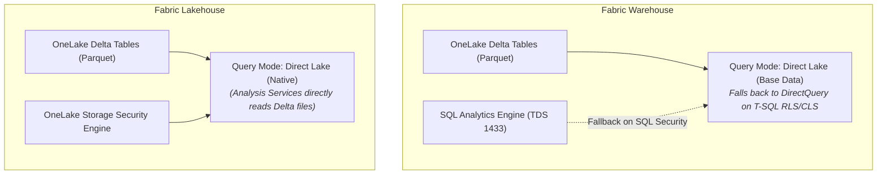
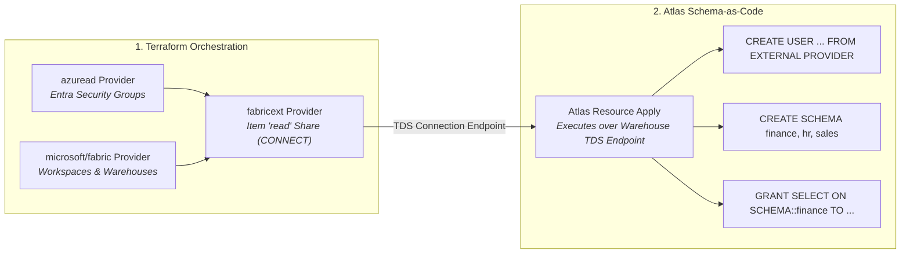

# Granular Access Control & Security Patterns in Microsoft Fabric

This architectural guide explains the multi-layered security architecture of Microsoft Fabric across Microsoft Entra ID, workspace boundaries, item-level sharing, SQL engine permissions (T-SQL), OneLake Data Access Roles, and Power BI semantic models.

It addresses how granular permissions propagate across data engines, how to manage Entra ID Object IDs vs. display names in SQL, how to isolate access to specific schemas within a Fabric Warehouse, how declarative schema migration tools like **Atlas** conceptually fit into database-level RBAC, and how [`terraform-provider-fabricext`](https://registry.terraform.io/providers/jambazid/fabricext/latest) enables an automated enterprise access model.

---

## 🎯 Common Access Goals & Security Solutions

The following matrix maps enterprise access control requirements to their Microsoft Fabric architectural solutions, highlighting where `terraform-provider-fabricext` enables declarative Infrastructure as Code (IaC):

| Access Goal / Scenario | Recommended Solution | Mechanism & Boundary | `fabricext` Provider Role |
| :--- | :--- | :--- | :--- |
| **Broad Workspace Access**<br/>User needs to read or collaborate on all items across a workspace. | Assign **Viewer** (read-only) or **Contributor** (read/write) workspace role. | **Layer 2 (Workspace)**<br/>Workspace role assignment via Fabric Portal or `microsoft/fabric`. | **Out of Scope**<br/>Handled by official `fabric_workspace_role_assignment`. |
| **Warehouse Schema Isolation**<br/>User needs access to schema `finance` only; all other schemas (`hr`, `sales`) must be denied. | Grant item **`read`** (connectivity only) + create Entra DB user + grant T-SQL schema permissions. | **Layer 3 (Item Share) + Layer 4 (SQL Engine)**<br/>Item share grants Tabular Data Stream (TDS) `CONNECT`; default-deny SQL engine restricts data access. | **Item Connectivity Gate**<br/>`fabricext_warehouse_permission` (`role_type = "read"`) grants TDS connection without granting `db_owner` rights. |
| **SQL Database Broad Access**<br/>User needs read access across all tables in a Fabric SQL Database. | Grant item-level **`read_data`** share on the SQL database item. | **Layer 3 (Item Share)**<br/>Item permission grants connectivity and broad data access across all tables. | **Direct**<br/>`fabricext_sql_database_permission` (`role_type = "read_data"`). |
| **Object-Level Security (OLS)**<br/>User can access specific tables or views within a schema, but sensitive tables are hidden. | Item **`read`** + T-SQL `GRANT SELECT ON table/view`. | **Layer 4 (SQL Engine)**<br/>SQL metadata hiding ensures unpermitted tables are invisible in `sys.tables`. | **Item Connectivity Gate**<br/>`fabricext_warehouse_permission` (`role_type = "read"`). |
| **SQL Row/Column Security (RLS/CLS)**<br/>Warehouse user should only see regional rows or cannot see credit card columns. | Item **`read`** + T-SQL Security Policies (predicate function) & `DENY SELECT ON table(col)`. | **Layer 4 (SQL Engine)**<br/>T-SQL execution engine filters rows/columns at query runtime. | **Item Connectivity Gate**<br/>`fabricext_warehouse_permission` (`role_type = "read"`). |
| **Lakehouse Path & Folder Access**<br/>Lakehouse user needs access to specific Delta folders or table paths without SQL engine. | Configure OneLake Data Access Role with path attribute scopes (`paths = ["/Tables/sales"]`). | **Layer 3 & 4 (OneLake Storage)**<br/>OneLake security engine evaluates path filters directly against storage calls. | **Direct**<br/>`fabricext_lakehouse_permission` (simple mode with `paths` and `actions = ["Read"]`). |
| **Lakehouse Storage RLS & CLS**<br/>Lakehouse user needs row-filtering or column-masking on Delta tables. | Configure OneLake Data Access Role with `row_constraint` and `column_constraint`. | **Layer 4 (OneLake Engine)**<br/>Storage-level RLS/CLS enforced by Analysis Services and OneLake. | **Direct**<br/>`fabricext_lakehouse_permission` (advanced mode with `decision_rule`). |
| **Cross-Workspace Data Sharing**<br/>Derive OneLake role membership from users who have item permissions on another Fabric item. | Configure Lakehouse role containing `fabric_item_member` referencing the source workspace and item path. | **Layer 3 & 4 (OneLake Security)**<br/>OneLake dynamically inherits role membership from the source item permissions. | **Direct**<br/>`fabricext_lakehouse_permission` (`fabric_item_member` blocks). |
| **Power BI Semantic Model Consumption**<br/>Power BI report users must only see data permitted by their Entra identity. | Use **Direct Lake mode with SSO**; falls back to DirectQuery over TDS when SQL RLS/CLS is active. | **Layer 5 (Consumption)**<br/>Power BI's semantic model engine (Analysis Services) flows the user's active Entra token to the data engine. | **Underlying Engine Gate**<br/>`fabricext_*` manages item connectivity and OneLake Data Access Roles. |
| **Enterprise RBAC & Schema Automation**<br/>Automate both item-level gates and internal database RBAC across environments. | Combine Terraform with declarative database schema-as-code operators (e.g. Atlas, Flyway, or Liquibase). | **Layers 1–4 Integrated**<br/>Terraform provisions Entra & Fabric gates; schema operator configures T-SQL objects. | **Prerequisite Gateway**<br/>Provides the prerequisite connectivity gate (`CONNECT`) enabling database-level operators. |

---

## 🎛️ Security Controls Inventory & Interaction Matrix

Microsoft Fabric evaluates access across six distinct security tiers. Understanding which tier takes precedence and how controls interact is essential for robust least-privilege design.

### 1. The Controls Inventory

| Tier | Control Type | Primary Governance Plane | Description |
| :--- | :--- | :--- | :--- |
| **Tier 1: Identity** | Entra ID Groups & Principals | Azure Entra ID / Graph | Authenticates users, service principals, and managed identities; establishes group memberships. |
| **Tier 2: Tenant & Capacity** | Tenant Switch Overrides & Domains | Fabric Admin Portal | Controls external sharing toggles, OneLake access API switches, and capacity assignment boundaries. |
| **Tier 3: Workspace Boundary** | Workspace Roles | Fabric Workspace API / `microsoft/fabric` | Roles: `Admin`, `Member`, `Contributor`, `Viewer`. Determines administrative and collaboration scope. |
| **Tier 4: Item Perimeter** | Item Shares & Permissions | Fabric Item Permission API / `fabricext` | Roles: `read` (CONNECT), `read_data`, `write`, `reshare`, OneLake Data Access Roles. Controls item discovery and gateway access. |
| **Tier 5: Data Engine RBAC** | T-SQL RBAC & OneLake Storage Roles | SQL TDS Engine / OneLake Storage Engine | T-SQL `GRANT`/`DENY` on Schemas/Tables/Views, SQL RLS/CLS, OneLake path filters, and row/column constraints. |
| **Tier 6: Consumption & BI** | Semantic Models & Power BI Apps | Power BI Analysis Services | DirectQuery vs. Direct Lake mode, Entra SSO token delegation, and dataset-level RLS/OLS. |

### 2. Control Precedence & Conflict Resolution Matrix

When multiple controls apply to a principal simultaneously, Fabric evaluates access according to strict precedence rules:

| Condition / Conflict | Evaluation Precedence | Net Effective Access | Architecture Rule |
| :--- | :--- | :--- | :--- |
| **Workspace `Member` vs. T-SQL `DENY`** | Workspace Role **overrides** T-SQL RBAC. | **Full Access** (`db_owner`) | Workspace `Admin`, `Member`, and `Contributor` bypass all SQL-level restrictions. |
| **Workspace `Viewer` vs. T-SQL `GRANT`** | T-SQL RBAC **governs** data query. | **Granular Access** | `Viewer` grants item visibility; SQL engine filters data according to T-SQL grants. |
| **Item `read_data` vs. T-SQL `DENY`** | Item `read_data` **bypasses** SQL schema isolation. | **Broad Data Access** | Fabric grants a synthetic read token across all tables when `read_data` is present. |
| **Item `read` vs. T-SQL Default-Deny** | T-SQL engine **governs** object access. | **Strict Schema Isolation** | `read` provides `CONNECT` only; ungranted schemas remain completely hidden and inaccessible. |
| **Lakehouse OneLake Role vs. Direct Lake** | OneLake Security **filters** storage reads. | **Filtered Parquet Access** | Analysis Services respects OneLake path filters and RLS/CLS when SSO is active. |
| **OneLake Role vs. Fallback DirectQuery** | SQL Analytics Endpoint **enforces** T-SQL RBAC. | **SQL Engine Governed** | If a Direct Lake query falls back to DirectQuery, SQL engine permissions take over. |
| **Dataset RLS vs. Underlying SQL RLS** | **Both** evaluated in series (Intersection). | **Most Restrictive Subset** | Power BI filters data in the semantic model; SQL engine filters data at query time via SSO. |

---

## 🛡️ The 5-Layer Security Perimeter Stack

Security in Microsoft Fabric is governed by five decoupled, cascading evaluation perimeters. A principal must clear each layer sequentially to read an underlying data element:



### Workspace Role Bypass Warning

> [!CAUTION]
> **Workspace Roles Bypass SQL Engine RBAC**:
> Users assigned **Admin**, **Member**, or **Contributor** roles on a Fabric workspace are automatically granted `db_owner` / full administrative privileges on all Warehouses and Lakehouses in that workspace.
> 
> T-SQL `DENY` statements, SQL Row-Level Security, and OneLake Data Access Roles **have no effect** on Admins, Members, or Contributors.
> 
> To enforce schema or row-level security, users must have **no workspace role** (pure item share) or at most the **Viewer** role.

---

## 🔒 Deep Dive: Warehouse Permissions & Schema Isolation

When you grant permissions using `fabricext_warehouse_permission`:

| Permission Token | API Action | SQL Engine Effect | Schema Visibility |
| :--- | :--- | :--- | :--- |
| **`read`** *(Recommended)* | `Read` | Grants database connectivity (`CONNECT`) over Tabular Data Stream (TDS, port 1433). | **Strictly Restricted**: User sees only schemas and objects explicitly granted in T-SQL. |
| **`write`** | `Write` | Grants permission to modify item metadata and write tables. | Full read/write access. |
| **`reshare`** | `Reshare` | Grants permission to share the warehouse with other principals. | Shareable access. |

*(Note: The broad `read_data` item token applies exclusively to Fabric SQL Databases via `fabricext_sql_database_permission`, not Warehouses).*



### Fabric Console Experience for Non-Workspace Members

When an Entra security group receives `read` via `fabricext_warehouse_permission` without workspace membership:

1. **OneLake Data Hub**: The Warehouse appears under the **"Shared with me"** tab and in the OneLake Data Hub catalog.
2. **Workspace Navigation**: The user **cannot** see the parent workspace in the workspace flyout menu.
3. **Web Query Editor**: Clicking the Warehouse opens the Web Query Editor. The object explorer renders only the schemas and tables that the user's Entra credentials have SQL permissions to view (metadata hiding). Schemas without `GRANT` permissions do not appear in the tree.
4. **Connection Endpoints**: The user can copy the TDS connection string (`*.datawarehouse.fabric.microsoft.com`) and connect via SSMS, Azure Data Studio, VS Code, Python, or DBeaver.

---

## 🆔 Entra ID Identity Binding: Display Names vs. Object IDs in T-SQL

A common practitioner challenge is understanding how Entra ID identities are mapped in T-SQL and how they relate to Terraform resources.

### 1. In Terraform (`fabricext` Provider)

`fabricext_warehouse_permission`, `fabricext_sql_database_permission`, and `fabricext_lakehouse_permission` **always use the Microsoft Entra Object ID (UUID)**:

```hcl
resource "fabricext_warehouse_permission" "example" {
  workspace_id   = "00000000-0000-0000-0000-000000000001"
  warehouse_id   = "00000000-0000-0000-0000-000000000002"
  principal_id   = azuread_group.finance_analysts.object_id # 36-character UUID
  principal_type = "Group"
  role_type      = "read"
}
```

The Fabric Permissions API requires the Entra Object ID UUID. Passing display names in `principal_id` will fail schema and UUID validation.

### 2. In the T-SQL Engine (Warehouse & SQL Database)

When executing `CREATE USER ... FROM EXTERNAL PROVIDER`:

```sql
CREATE USER [SEC-Fabric-Finance-Analysts] FROM EXTERNAL PROVIDER;
```

`[SEC-Fabric-Finance-Analysts]` is the **Microsoft Entra Security Group display name**. When issued, the SQL engine queries Microsoft Entra ID (via Microsoft Graph) to resolve the display name to its Entra Object ID and internal Security Identifier (SID).

> [!NOTE]
> **T-SQL Name Resolution**: In T-SQL `CREATE USER [name] FROM EXTERNAL PROVIDER`, `name` must match the Microsoft Entra Display Name or UPN. Passing a raw UUID string inside brackets `[<guid>]` will fail with an error (`Principal could not be found`) unless the Entra principal's display name literally matches that UUID string.

#### Recommended Dual-Plane Pattern

| Plane | Tool | Identity Identifier | Rationale |
| :--- | :--- | :--- | :--- |
| **Item Gate** | Terraform (`fabricext`) | Microsoft Entra **Object ID (UUID)** | Immutable; impervious to Entra group renames in Azure Portal. |
| **SQL Engine** | T-SQL / Schema Operator | Microsoft Entra **Display Name** | Human-readable in DBA query plans, SSMS Object Explorer, and audit logs. |

---

## ⚡ Power BI Propagation: Direct Lake vs. DirectQuery

A frequent area of confusion is whether Warehouse schema restrictions propagate into Power BI "Direct Lake" queries.

### Warehouses vs. Lakehouses: Query Modes



Both Microsoft Fabric Warehouses and Lakehouses persist data in OneLake in open Delta Lake (Parquet) format with V-Order optimization, and both support Direct Lake default semantic models.

However, a fundamental architectural difference exists in **how security is enforced**:

- **Lakehouses** enforce security at the storage layer using **OneLake Data Access Roles**. Power BI's semantic model engine (Analysis Services / VertiPaq) reads Parquet files directly from OneLake while OneLake evaluates storage-level RLS predicates, CLS column constraints, and path filters under Single Sign-On (SSO).
- **Warehouses** enforce security at the query engine layer using T-SQL RBAC over Tabular Data Stream (TDS, port 1433).
- **Automatic Fallback on SQL Security**: When database-level security—such as T-SQL Row-Level Security (RLS), Column-Level Security (CLS), or Object-Level Security (OLS)—is configured on a Warehouse, Power BI's VertiPaq engine **automatically falls back from Direct Lake to DirectQuery over TDS** so that SQL security policies evaluate dynamically against the querying user's Entra ID identity.

### How Power BI Enforces Identity & Permissions

#### Scenario A: Power BI Querying a Warehouse (DirectQuery with SSO)

1. **Connection Mode**: DirectQuery over the SQL endpoint.
2. **Credential Mode**: **Single Sign-On (SSO)** enabled via Microsoft Entra ID.
3. **Propagation**:
   - The user opens a Power BI report.
   - Power BI passes the user's active Entra token directly to the Warehouse SQL endpoint.
   - The Warehouse evaluates the user's group memberships against the T-SQL schema grants and RLS policies.
   - If the report attempts to query `hr.salaries` and the user only has access to `finance.*`, **the visual fails with a permissions error**.
4. **Fixed Identity Alternative**: If the dataset uses a Service Principal with broad access, the Warehouse engine does not see the end user. You must then enforce security inside the Power BI dataset using **Power BI Row-Level Security (RLS)** and **Object-Level Security (OLS)** mapped to Entra security groups.

> [!WARNING]
> **Power BI Service SSO Configuration Required**: When configuring a semantic model connected to a Warehouse or SQL Analytics endpoint in the Power BI Service, administrators **must check the box**: *"Report viewers can only access this data source with their own Power BI identities using Direct Query"* (Single Sign-On / SSO). If this setting is not enabled, Power BI executes all report queries using the fixed credentials of the dataset owner or gateway service account, completely bypassing user-level T-SQL grants and causing an unintended privilege exposure.

#### Scenario B: Power BI Querying a Lakehouse (Direct Lake with OneLake Roles)

1. **Connection Mode**: Direct Lake.
2. **Execution**: The Analysis Services engine reads Delta Lake Parquet files directly from OneLake without going through the SQL engine.
3. **Propagation**:
   - Fabric Lakehouses enforce **OneLake Data Access Roles** (managed declaratively via `fabricext_lakehouse_permission` advanced mode).
   - When SSO is enabled, OneLake validates the user's Entra identity against the role's path filters, table actions, RLS predicates, and CLS column masks.
   - If a table or column is restricted in the OneLake role, Direct Lake either enforces the restriction or transparently falls back to DirectQuery over the SQL endpoint.

---

## 🔄 Enterprise RBAC Automation: Integrating Terraform with Schema Operators

While `fabricext` manages the Fabric item boundary (`CONNECT`), managing internal database schemas, tables, roles, and `GRANT SELECT` statements across dozens of Warehouses is typically automated using a declarative database schema management tool or migration framework (such as [**Atlas**](https://atlasgo.io/), Flyway, Liquibase, or the Terraform `mssql` provider).

### The End-to-End Governance Model



### Conceptual Blueprint: Terraform + `fabricext` + Atlas

In this architecture, Terraform provisions the Entra group, Fabric workspace, and warehouse item. `fabricext` grants item connectivity to the Entra group, and an Atlas resource apply step declaratively configures internal database security:

```hcl
# --- 1. Identity & Workspace Provisioning ---
resource "azuread_group" "finance_analysts" {
  display_name     = "SEC-Fabric-Finance-Analysts"
  security_enabled = true
}

resource "fabric_workspace" "analytics" {
  display_name = "Enterprise Analytics"
}

resource "fabric_warehouse" "corporate_dw" {
  workspace_id = fabric_workspace.analytics.id
  display_name = "corporate_dw"
}

# --- 2. Item-Level Gate via fabricext ---
# Grants TDS connectivity (CONNECT) without broad read_data privileges
resource "fabricext_warehouse_permission" "finance_access" {
  workspace_id   = fabric_workspace.analytics.id
  warehouse_id   = fabric_warehouse.corporate_dw.id
  principal_id   = azuread_group.finance_analysts.object_id
  principal_type = "Group"
  role_type      = "read"
}

# --- 3. Declarative SQL RBAC via Atlas (Conceptual Pseudocode) ---
# Note: This is generic conceptual pseudocode representing a database
# schema-as-code operator managing SQL objects over the TDS endpoint.
resource "atlas_resource" "warehouse_rbac" {
  target_database = fabric_warehouse.corporate_dw.display_name
  schema_file     = "./schemas/warehouse_security.hcl"

  depends_on = [
    fabricext_warehouse_permission.finance_access
  ]
}
```

---

## 📚 Registry Documentation Links

For individual guides structured specifically for the Terraform Registry:

- [Use Cases Overview](https://registry.terraform.io/providers/jambazid/fabricext/latest/docs/guides/use_case_overview)
- [Security Controls Inventory & Interaction Matrix](https://registry.terraform.io/providers/jambazid/fabricext/latest/docs/guides/use_case_controls_and_interactions)
- [Warehouse Schema Isolation & Declarative RBAC](https://registry.terraform.io/providers/jambazid/fabricext/latest/docs/guides/use_case_warehouse_schema_isolation)
- [Lakehouse OneLake Security & Data Access Roles](https://registry.terraform.io/providers/jambazid/fabricext/latest/docs/guides/use_case_lakehouse_onelake_security)
- [Power BI Identity Flow: Direct Lake vs. DirectQuery](https://registry.terraform.io/providers/jambazid/fabricext/latest/docs/guides/use_case_powerbi_identity_propagation)
