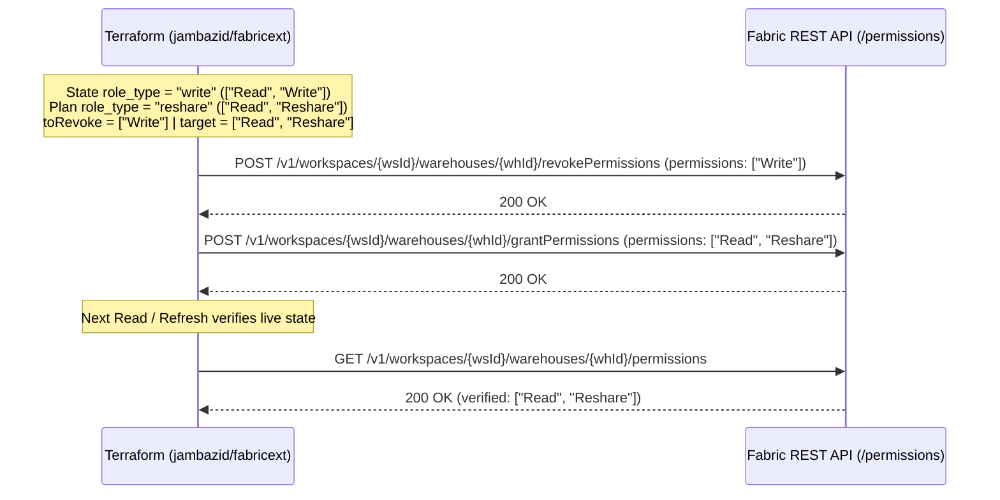
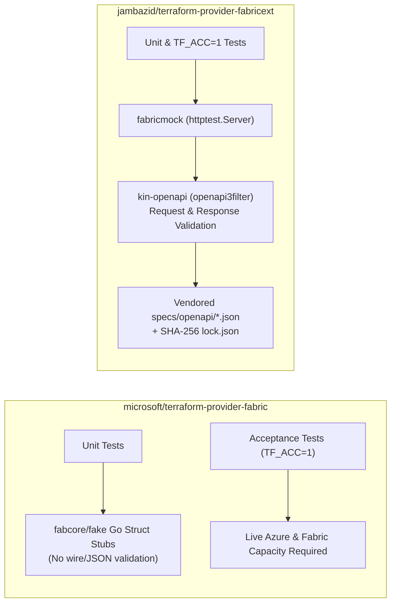

# Official Fabric Provider Comparison

Comparative architecture analysis between Microsoft's official Terraform provider ([`microsoft/terraform-provider-fabric`](https://github.com/microsoft/terraform-provider-fabric), `registry.terraform.io/microsoft/fabric`) and this community extension provider (`registry.terraform.io/jambazid/fabricext`).

---

## Executive Summary

| Dimension | `microsoft/fabric` (Official) | `jambazid/fabricext` (Community) |
| :--- | :--- | :--- |
| **Scope** | Workspace and item lifecycle provisioning | Declarative item-level sharing & OneLake roles |
| **API Layer** | Bound to generated `fabric-sdk-go` client | Targeted REST/RPC client unblocking item permissions |
| **OneLake Roles** | Preview endpoints; strict object type validation | GA endpoints, mutex + ETag Read-Modify-Write (RMW), dual-mode RLS/CLS |
| **Testing** | In-memory SDK fake clients; live cloud required for acceptance | Hermetic `fabricmock` + runtime `kin-openapi` validation |

### Architectural Trade-Off Analysis

| Dimension | Cost | Impact | Risk |
| :--- | :--- | :--- | :--- |
| **Item Sharing Scope** | Low | High: Unblocks item-level sharing and OneLake roles | Low: Distinct `fabricext_*` prefix |
| **Targeted REST Client** | Low | High: Enables endpoints absent from upstream Swagger | Low: OpenAPI contract validation |
| **OneLake Concurrency** | Low | High: Race-safe updates under parallel `for_each` | Low: Identical import ID format |
| **Offline Test Suite** | Low | High: Sub-10s hermetic `TF_ACC=1` acceptance testing | Low: Continuous Swagger sync checks |

---

## Upstream Gap Analysis

### Item Permissions Gap

Microsoft Fabric exposes item-level permission endpoints (`GET /permissions`, `POST /grantPermissions`, `POST /revokePermissions`) for Warehouses and SQL Databases, but the official provider does not currently offer resources managing these item-level permissions.

1. **Upstream OpenAPI & SDK Code Generation Lifecycle**:
   - `microsoft/terraform-provider-fabric` delegates all HTTP calls to `github.com/microsoft/fabric-sdk-go`.
   - `fabric-sdk-go` is strictly code-generated from [`microsoft/fabric-rest-api-specs`](https://github.com/microsoft/fabric-rest-api-specs).
   - Because `warehouse/swagger.json` and `sqlDatabase/swagger.json` do not yet include the `/permissions`, `/grantPermissions`, and `/revokePermissions` path definitions, `fabric-sdk-go` exposes no client methods for them, blocking the official provider.
<a id="additive-grant-vs-declarative-reconciliation"></a>
2. **Additive Grant vs. Declarative Reconciliation**:
   - Fabric's `POST /grantPermissions` endpoint is **additive**: calling `grantPermissions` with `["Read"]` on a principal that currently holds `["Read", "Write", "Reshare"]` leaves `"Write"` and `"Reshare"` intact.
   - `jambazid/fabricext` bridges this gap via a formal OpenAPI overlay (`specs/openapi/overlays/item-permissions.json`) and set-difference reconciliation in `FabricClient.UpdateItemPermissions`:
     - Revokes removed permissions first (`current \ target`) under declarative downgrade reconciliation so downgrades never leave excess privileges.
     - Grants target permissions (`target`) to establish the complete desired state.



### OneLake Roles Comparison

| Aspect | `microsoft/fabric` (`fabric_onelake_data_access_security`) | `jambazid/fabricext` (`fabricext_lakehouse_permission`) |
| :--- | :--- | :--- |
| **Maturity Gate** | Preview-only (`preview = true`) | GA endpoints by default |
| **Resource Modes** | Single-mode nested blocks | Dual-mode: simple flat or advanced structured |
| **Item Identification** | UUID only (`item_id`) | UUID (`lakehouse_id`) or display name (`lakehouse_name`) |
| **RLS & CLS** | Supported in `decision_rules` | Supported in `decision_rule` blocks (100% parity) |
| **Members & Shortcuts** | Entra members and shortcut items | Entra members and shortcut items (`fabric_item_member`) |
| **Concurrency** | Direct API calls without client-side serialization | Per-Lakehouse mutex + `If-Match` ETag Read-Modify-Write (RMW) retry |
| **Read-Back Drift** | Fails on omitted `objectType` ([#1044](https://github.com/microsoft/terraform-provider-fabric/issues/1044)) | Preserves `PrincipalType` on empty API read-back |
| **Import ID** | `{workspace_id}/{item_id}/{role_name}` | `{workspace_id}/{lakehouse_id}/{role_name}` (100% parity) |

#### OneLake Roles vs Item Sharing

> [!NOTE]
> **OneLake Data Access Roles vs. Lakehouse Item Sharing**:
>
> - **OneLake Data Access Roles** (Storage Layer): Both `microsoft/fabric` (`fabric_onelake_data_access_security`) and `jambazid/fabricext` (`fabricext_lakehouse_permission`) manage OneLake Data Access Roles via the OneLake Data Access Security API (`/v1/.../items/{id}/dataAccessRoles`). These roles govern fine-grained access to Parquet tables, folders, rows (RLS), and columns (CLS) in OneLake storage.
> - **Lakehouse Item-Level Sharing** (Workspace Layer): Fabric item-level sharing (`ReadAll` workspace share grants at the Fabric item level) does not currently have a public REST API for Lakehouses, as discussed in [microsoft/terraform-provider-fabric#425](https://github.com/microsoft/terraform-provider-fabric/issues/425). Neither provider manages Lakehouse item-level sharing until Microsoft makes that API available.

---

## Authentication and Dual-Provider Coexistence

Practitioners frequently run `microsoft/fabric` (to provision workspaces and items) and `jambazid/fabricext` (to manage item permissions) side by side in the same root module.

### Credential and Environment Parity

`jambazid/fabricext` supports both standard Azure SDK (`AZURE_*`, `ARM_*`) and official Fabric provider (`FABRIC_*`) environment variables in `internal/credentials/chain.go` and `internal/provider/provider.go`, allowing a single set of CI/CD environment variables to authenticate both providers simultaneously:

| Attribute | `microsoft/fabric` Env Vars | `jambazid/fabricext` Env Vars | Notes |
| :--- | :--- | :--- | :--- |
| `endpoint` | `FABRIC_ENDPOINT` | `FABRIC_ENDPOINT` | Defaults to `https://api.fabric.microsoft.com` (normalized to `/v1` automatically). |
| `tenant_id` | `FABRIC_TENANT_ID` | `AZURE_TENANT_ID`, `ARM_TENANT_ID`, `FABRIC_TENANT_ID` | Entra ID tenant UUID. |
| `client_id` | `FABRIC_CLIENT_ID` | `AZURE_CLIENT_ID`, `ARM_CLIENT_ID`, `FABRIC_CLIENT_ID` | Service Principal / Managed Identity client ID. |
| `client_secret` | `FABRIC_CLIENT_SECRET` | `AZURE_CLIENT_SECRET`, `ARM_CLIENT_SECRET`, `FABRIC_CLIENT_SECRET` | Marked `Sensitive: true` and redacted via `Credentials.String()` / `GoString()`. |
| `use_oidc` | `FABRIC_USE_OIDC` | `AZURE_USE_OIDC`, `ARM_USE_OIDC`, `FABRIC_USE_OIDC` | Uses `azidentity.NewWorkloadIdentityCredential` in GitHub Actions / ADO. |
| `use_msi` | `FABRIC_USE_MSI` | `AZURE_USE_MSI`, `ARM_USE_MSI`, `FABRIC_USE_MSI` | Uses `azidentity.NewManagedIdentityCredential`. |
| `use_cli` | `FABRIC_USE_CLI` | `AZURE_USE_CLI`, `ARM_USE_CLI`, `FABRIC_USE_CLI` | Uses `azidentity.NewAzureCLICredential`. |
| `access_token` | *(Not supported)* | `FABRIC_ACCESS_TOKEN` | Static bearer token override; enables zero-network `TF_ACC=1` testing. |
| `request_timeout` | `FABRIC_TIMEOUT` | `FABRIC_REQUEST_TIMEOUT` | Per-request HTTP timeout (Go duration string, defaults to `"60s"`). |
| `skip_credentials_validation` | *(Not supported)* | `FABRIC_SKIP_CREDENTIALS_VALIDATION` | Skips eager token validation in `Configure()` when set to `true`. |

### Dual-Provider HCL Pattern

Because `jambazid/fabricext` resources accept human-readable item names (`warehouse_name`, `sql_database_name`, `lakehouse_name`) and resolve them via a paginated, type-isolated `(workspaceID, itemType, displayName)` cache, referencing `display_name` from a `microsoft/fabric` resource automatically establishes the Terraform dependency graph edge:

```hcl
terraform {
  required_version = ">= 1.7.0"
  required_providers {
    fabric = {
      source  = "microsoft/fabric"
      version = "~> 1.0"
    }
    fabricext = {
      source  = "jambazid/fabricext"
      version = "~> 0.2.1"
    }
  }
}

provider "fabric" {}
provider "fabricext" {}

resource "fabric_warehouse" "sales" {
  workspace_id = var.workspace_id
  display_name = "sales_wh"
}

resource "fabricext_warehouse_permission" "analysts" {
  provider       = fabricext
  workspace_id   = fabric_warehouse.sales.workspace_id
  warehouse_name = fabric_warehouse.sales.display_name
  principal_id   = var.analysts_group_oid
  principal_type = "Group"
  role_type      = "read"
}
```

---

## Schema and Implementation Idioms

| Pattern | `microsoft/fabric` Convention | `jambazid/fabricext` Convention | Trade-Off & Rationale |
| :--- | :--- | :--- | :--- |
| **Principal Modeling** | Nested attribute `principal = { id, type }` | Flat `principal_id` and `principal_type` | Flat attributes simplify `for_each` mapping and module flattening |
| **Item Identification** | Requires `item_id` UUID | Accepts display name or UUID | Eliminates data source boilerplate; resolves via type-isolated cache |
| **UUID Validation** | Custom `customtypes.UUID` type | `stringvalidator.RegexMatches` regex | Plan-time validation without third-party type coupling |
| **404 Drift Recovery** | `resp.State.RemoveResource(ctx)` | `resp.State.RemoveResource(ctx)` | 100% aligned: both cleanly plan recreation on external deletion |
| **Import State IDs** | Slash-delimited composite UUIDs | Slash-delimited composite IDs | 100% aligned: identical IDs enable zero-downtime state migration |

---

## Testing and Verification Comparison



- **Why `kin-openapi` Contract Validation Matters**:
  - Go struct fakes (`fabcore/fake`) only test that the provider passes Go structs matching the current SDK version; they do not validate URL routing, query parameters, ETag headers (`ETag` / `If-Match`), or JSON wire serialization against the OpenAPI specification.
  - `internal/testutil/fabricmock/server.go` converts the vendored Swagger 2.0 specs (`specs/openapi/`) into OpenAPI v3 via `kin-openapi/openapi2conv` and validates every incoming HTTP request and outgoing HTTP response across `fabricmock`-backed unit tests and acceptance tests (`mise run test:acc` with `TF_ACC=1`).

---

## State Migration Playbook

When `microsoft/fabric` promotes OneLake Data Access Security to GA and adds native Warehouse/SQL Database item-permission resources, practitioners can migrate state with **zero permission revocation or downtime** using Terraform 1.7+ `removed` and `import` blocks.

> [!IMPORTANT]
> **Terraform Version Prerequisite**: Declarative `removed` blocks with `lifecycle { destroy = false }` require Terraform `>= 1.7.0`. For deployments running Terraform 1.6.x, practitioners should use the imperative CLI command `terraform state rm <resource_address>` prior to applying the target `import` block.

> [!TIP]
> **Retrieving Resolved Item UUIDs Before Migration**: Every `jambazid/fabricext` permission resource stores the resolved Fabric item UUID in state (`lakehouse_id`, `warehouse_id`, or `sql_database_id`). Before replacing a `fabricext_*` resource block, inspect state with `terraform state show` (or reference `data.fabricext_item`) to obtain the item UUID for your `import` block.

### Lakehouse Role Migration

Because `fabricext_lakehouse_permission` and `fabric_onelake_data_access_security` share the exact `{workspace_id}/{lakehouse_id}/{role_name}` composite import ID:

```hcl
# 1. Detach from jambazid/fabricext state without deleting the OneLake role in Fabric
removed {
  from = fabricext_lakehouse_permission.bronze_readers

  lifecycle {
    destroy = false
  }
}

# 2. Declare the target official microsoft/fabric resource
resource "fabric_onelake_data_access_security" "bronze_readers" {
  workspace_id = var.workspace_id
  item_id      = var.lakehouse_id
  role_name    = "BronzeReaders"
  # ... configure decision_rules and members matching BronzeReaders ...
}

# 3. Import the existing OneLake role into the official microsoft/fabric resource
import {
  to = fabric_onelake_data_access_security.bronze_readers
  id = "${var.workspace_id}/${var.lakehouse_id}/BronzeReaders"
}
```

### Warehouse Permission Migration

`fabricext_warehouse_permission` maps `role_type` (`read`, `write`, `reshare`) to Fabric item permissions (`["Read"]`, `["Read", "Write"]`, `["Read", "Reshare"]`). When `microsoft/fabric` ships native Warehouse item permission resources:

> [!NOTE]
> **Illustrative Migration Pseudocode**: The `fabric_item_permission` resource block below is conceptual pseudocode illustrating the Terraform 1.7+ migration pattern. Upstream resource names, schemas, and import ID conventions have not yet been defined by Microsoft.

```hcl
# 1. Detach from jambazid/fabricext state without revoking the Warehouse permission in Fabric
removed {
  from = fabricext_warehouse_permission.analysts

  lifecycle {
    destroy = false
  }
}

# 2. Declare the target official microsoft/fabric item permission resource (hypothetical schema)
resource "fabric_item_permission" "analysts_warehouse" {
  workspace_id = var.workspace_id
  item_id      = var.warehouse_id
  # ... configure principal and permissions matching ["Read"] ...
}

# 3. Import into the official microsoft/fabric resource (syntax subject to upstream specification)
import {
  to = fabric_item_permission.analysts_warehouse
  id = "${var.workspace_id}/${var.warehouse_id}/${var.analysts_group_oid}"
}
```

### SQL Database Permission Migration

`fabricext_sql_database_permission` supports five granular SQL Database permission presets across the TDS SQL endpoint, Spark/OneLake mirror, and event subscriptions:

| `jambazid/fabricext` `role_type` | Underlying Fabric API Permissions | Scope |
| :--- | :--- | :--- |
| `read` | `["Read"]` | Item-level connection metadata without table read access. |
| `read_data` | `["Read", "ReadData"]` | Read data via the SQL Database TDS endpoint (`ReadData`). |
| `read_spark` | `["Read", "ReadAll", "SubscribeOneLakeEvents"]` | Read mirrored OneLake Parquet tables via Spark (`ReadAll`) and subscribe to OneLake events. |
| `write` | `["Read", "Write"]` | Read and modify SQL Database schema and data. |
| `reshare` | `["Read", "Reshare"]` | Read and re-share the SQL Database with additional principals. |

When `microsoft/fabric` ships native SQL Database item permission resources, detach the `fabricext` resource with `destroy = false` and import the existing SQL Database grant:

> [!NOTE]
> **Illustrative Migration Pseudocode**: The `fabric_item_permission` resource block below is conceptual pseudocode illustrating the Terraform 1.7+ migration pattern. Upstream resource names, schemas, and import ID conventions have not yet been defined by Microsoft.

```hcl
# 1. Detach from jambazid/fabricext state without revoking the SQL Database permission in Fabric
removed {
  from = fabricext_sql_database_permission.orders_tds_readers

  lifecycle {
    destroy = false
  }
}

# 2. Declare the target official microsoft/fabric item permission resource (hypothetical schema)
resource "fabric_item_permission" "orders_tds_readers" {
  workspace_id = var.workspace_id
  item_id      = var.sql_database_id
  # ... configure principal and permissions matching ["Read", "ReadData"] ...
}

# 3. Import into the official microsoft/fabric resource (syntax subject to upstream specification)
import {
  to = fabric_item_permission.orders_tds_readers
  id = "${var.workspace_id}/${var.sql_database_id}/${var.analysts_group_oid}"
}
```
